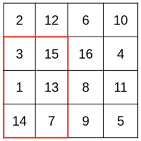

<h1 style='text-align: center;'> A. Subrectangle Guess</h1>

<h5 style='text-align: center;'>time limit per test: 1 second</h5>
<h5 style='text-align: center;'>memory limit per test: 256 megabytes</h5>

Michael and Joe are playing a game. The game is played on a grid with $n$ rows and $m$ columns, filled with distinct integers. We denote the square on the $i$-th ($1\le i\le n$) row and $j$-th ($1\le j\le m$) column by $(i, j)$ and the number there by $a_{ij}$.

Michael starts by saying two numbers $h$ ($1\le h \le n$) and $w$ ($1\le w \le m$). Then Joe picks any $h\times w$ subrectangle of the board (without Michael seeing).

Formally, an $h\times w$ subrectangle starts at some square $(a,b)$ where $1 \le a \le n-h+1$ and $1 \le b \le m-w+1$. It contains all squares $(i,j)$ for $a \le i \le a+h-1$ and $b \le j \le b+w-1$.

  Possible move by Joe if Michael says $3\times 2$ (with maximum of $15$). Finally, Michael has to guess the maximum number in the subrectangle. He wins if he gets it right.

Because Michael doesn't like big numbers, he wants the area of the chosen subrectangle (that is, $h \cdot w$), to be as small as possible, while still ensuring that he wins, not depending on Joe's choice. Help Michael out by finding this minimum possible area. 

It can be shown that Michael can always choose $h, w$ for which he can ensure that he wins.

## Input

Each test contains multiple test cases. The first line contains the number of test cases $t$ ($1 \le t \le 20$). Description of the test cases follows.

The first line of each test case contains two integers $n$ and $m$ ($1 \le n, m \le 40$)  — the size of the grid.

Each of the following $n$ lines contains $m$ integers. The $j$-th integer on the $i$-th line is $a_{ij}$ ($-10^9 \le a_{ij} \le 10^9$)  — the element in the cell $(i, j)$.

It is guaranteed that all the numbers are distinct (that is, if $a_{i_1j_1} = a_{i_2j_2}$, then $i_1 = i_2, j_1 = j_2$).

## Output

For each test case print a single positive integer  — the minimum possible area the subrectangle can have while still ensuring that Michael can guarantee the victory.

## Example

## Input


```

31 134 42 12 6 103 15 16 41 13 8 1114 7 9 52 3-7 5 20 8 -3
```
## Output


```

1
9
4

```
## Note

In the first test case, the grid is $1\times 1$, so the only possible choice for $h, w$ is $h = 1, w = 1$, giving an area of $h\cdot w = 1$.

The grid from the second test case is drawn in the statement. It can be shown that with $h = 3, w = 3$ Michael can guarantee the victory and that any choice with $h\cdot w \le 8$ doesn't.


#### tags 

#800 #games 