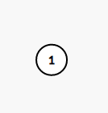
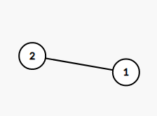
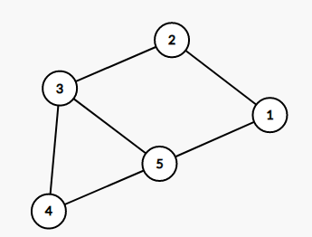
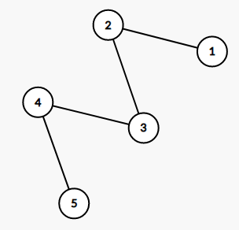
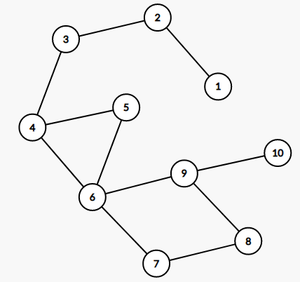

<h1 style='text-align: center;'> D. Permutation Graph</h1>

<h5 style='text-align: center;'>time limit per test: 2 seconds</h5>
<h5 style='text-align: center;'>memory limit per test: 512 megabytes</h5>

A permutation is an array consisting of $n$ distinct integers from $1$ to $n$ in arbitrary order. For example, $[2,3,1,5,4]$ is a permutation, but $[1,2,2]$ is not a permutation ($2$ appears twice in the array) and $[1,3,4]$ is also not a permutation ($n=3$ but there is $4$ in the array).

You are given a permutation of $1,2,\dots,n$, $[a_1,a_2,\dots,a_n]$. For integers $i$, $j$ such that $1\le i<j\le n$, define $\operatorname{mn}(i,j)$ as $\min\limits_{k=i}^j a_k$, and define $\operatorname{mx}(i,j)$ as $\max\limits_{k=i}^j a_k$.

Let us build an undirected graph of $n$ vertices, numbered $1$ to $n$. For every pair of integers $1\le i<j\le n$, if $\operatorname{mn}(i,j)=a_i$ and $\operatorname{mx}(i,j)=a_j$ both holds, or $\operatorname{mn}(i,j)=a_j$ and $\operatorname{mx}(i,j)=a_i$ both holds, add an undirected edge of length $1$ between vertices $i$ and $j$.

In this graph, find the length of the shortest path from vertex $1$ to vertex $n$. We can prove that $1$ and $n$ will always be connected via some path, so a shortest path always exists.

## Input

Each test contains multiple test cases. The first line contains the number of test cases $t$ ($1 \le t \le 5\cdot 10^4$). Description of the test cases follows.

The first line of each test case contains one integer $n$ ($1\le n\le 2.5\cdot 10^5$).

The second line of each test case contains $n$ integers $a_1$, $a_2$, $\ldots$, $a_n$ ($1\le a_i\le n$). It's guaranteed that $a$ is a permutation of $1$, $2$, $\dots$, $n$.

It is guaranteed that the sum of $n$ over all test cases does not exceed $5\cdot 10^5$.

## Output

For each test case, print a single line containing one integer — the length of the shortest path from $1$ to $n$.

## Example

## Input


```

51121 251 4 2 3 552 1 5 3 4107 4 8 1 6 10 3 5 2 9
```
## Output


```

0
1
1
4
6

```
## Note

The following are illustrations of constructed graphs in example test cases.

  the constructed graph in test case 1   the constructed graph in test case 2   the constructed graph in test case 3   the constructed graph in test case 4   the constructed graph in test case 5 

#### tags 

#1900 #binary_search #constructive_algorithms #data_structures #divide_and_conquer #greedy #shortest_paths 