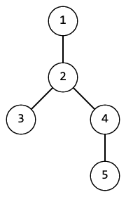

<h1 style='text-align: center;'> G1. Passable Paths (easy version)</h1>

<h5 style='text-align: center;'>time limit per test: 2 seconds</h5>
<h5 style='text-align: center;'>memory limit per test: 256 megabytes</h5>

This is an easy version of the problem. The only difference between an easy and a hard version is in the number of queries.

Polycarp grew a tree from $n$ vertices. We remind you that a tree of $n$ vertices is an undirected connected graph of $n$ vertices and $n-1$ edges that does not contain cycles.

He calls a set of vertices passable if there is such a path in the tree that passes through each vertex of this set without passing through any edge twice. The path can visit other vertices (not from this set).

In other words, a set of vertices is called passable if there is a simple path that passes through all the vertices of this set (and possibly some other).

For example, for a tree below sets $\{3, 2, 5\}$, $\{1, 5, 4\}$, $\{1, 4\}$ are passable, and $\{1, 3, 5\}$, $\{1, 2, 3, 4, 5\}$ are not.

  Polycarp asks you to answer $q$ queries. Each query is a set of vertices. For each query, you need to determine whether the corresponding set of vertices is passable.

## Input

The first line of input contains a single integer $n$ ($1 \le n \le 2 \cdot 10^5$) — number of vertices.

Following $n - 1$ lines a description of the tree..

Each line contains two integers $u$ and $v$ ($1 \le u, v \le n$, $u \ne v$) — indices of vertices connected by an edge.

Following line contains single integer $q$ ($1 \le q \le 5$) — number of queries.

The following $2 \cdot q$ lines contain descriptions of sets.

The first line of the description contains an integer $k$ ($1 \le k \le n$) — the size of the set.

The second line of the description contains $k$ of distinct integers $p_1, p_2, \dots, p_k$ ($1 \le p_i \le n$) — indices of the vertices of the set.

It is guaranteed that the sum of $k$ values for all queries does not exceed $2 \cdot 10^5$.

## Output

## Output

 $q$ lines, each of which contains the answer to the corresponding query. As an answer, output "YES" if the set is passable, and "NO" otherwise.

You can output the answer in any case (for example, the strings "yEs", "yes", "Yes" and "YES" will be recognized as a positive answer).

## Examples

## Input


```

5
1 2
2 3
2 4
4 5
5
3
3 2 5
5
1 2 3 4 5
2
1 4
3
1 3 5
3
1 5 4

```
## Output


```

YES
NO
YES
NO
YES

```
## Input


```

5
1 2
3 2
2 4
5 2
4
2
3 1
3
3 4 5
3
2 3 5
1
1

```
## Output


```

YES
NO
YES
YES

```


#### tags 

#1900 #dfs_and_similar #trees 