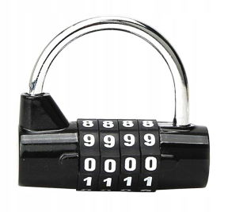

<h1 style='text-align: center;'> C. Cypher</h1>

<h5 style='text-align: center;'>time limit per test: 1 second</h5>
<h5 style='text-align: center;'>memory limit per test: 256 megabytes</h5>

Luca has a cypher made up of a sequence of $n$ wheels, each with a digit $a_i$ written on it. On the $i$-th wheel, he made $b_i$ moves. Each move is one of two types: 

* up move (denoted by $\texttt{U}$): it increases the $i$-th digit by $1$. After applying the up move on $9$, it becomes $0$.
* down move (denoted by $\texttt{D}$): it decreases the $i$-th digit by $1$. After applying the down move on $0$, it becomes $9$.

  ## Example

 for $n=4$. The current sequence is 0 0 0 0. Luca knows the final sequence of wheels and the moves for each wheel. Help him find the original sequence and crack the cypher.

## Input

The first line contains a single integer $t$ ($1 \leq t \leq 100$) — the number of test cases.

The first line of each test case contains a single integer $n$ ($1 \leq n \leq 100$) — the number of wheels.

The second line contains $n$ integers $a_i$ ($0 \leq a_i \leq 9$) — the digit shown on the $i$-th wheel after all moves have been performed.

Then $n$ lines follow, the $i$-th of which contains the integer $b_i$ ($1 \leq b_i \leq 10$) and $b_i$ characters that are either $\texttt{U}$ or $\texttt{D}$ — the number of moves performed on the $i$-th wheel, and the moves performed. $\texttt{U}$ and $\texttt{D}$ represent an up move and a down move respectively.

## Output

For each test case, output $n$ space-separated digits  — the initial sequence of the cypher.

## Example

## Input


```

339 3 13 DDD4 UDUU2 DU20 99 DDDDDDDDD9 UUUUUUUUU50 5 9 8 310 UUUUUUUUUU3 UUD8 UUDUUDDD10 UUDUUDUDDU4 UUUU
```
## Output


```

2 1 1 
9 0 
0 4 9 6 9 

```
## Note

In the first test case, we can prove that initial sequence was $[2,1,1]$. In that case, the following moves were performed: 

* On the first wheel: $2 \xrightarrow[\texttt{D}]{} 1 \xrightarrow[\texttt{D}]{} 0 \xrightarrow[\texttt{D}]{} 9$.
* On the second wheel: $1 \xrightarrow[\texttt{U}]{} 2 \xrightarrow[\texttt{D}]{} 1 \xrightarrow[\texttt{U}]{} 2 \xrightarrow[\texttt{U}]{} 3$.
* On the third wheel: $1 \xrightarrow[\texttt{D}]{} 0 \xrightarrow[\texttt{U}]{} 1$.

 The final sequence was $[9,3,1]$, which matches the input.

#### tags 

#800 #brute_force #implementation #strings 