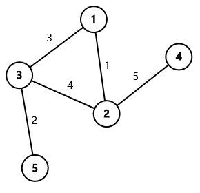

<h1 style='text-align: center;'> C. DFS Trees</h1>

<h5 style='text-align: center;'>time limit per test: 1 second</h5>
<h5 style='text-align: center;'>memory limit per test: 256 megabytes</h5>

You are given a connected undirected graph consisting of $n$ vertices and $m$ edges. The weight of the $i$-th edge is $i$.

Here is a wrong algorithm of finding a [minimum spanning tree](https://en.wikipedia.org/wiki/Minimum_spanning_tree) (MST) of a graph:


```
  
vis := an array of length n  
s := a set of edges  
  
function dfs(u):  
    vis[u] := true  
    iterate through each edge (u, v) in the order from smallest to largest edge weight  
        if vis[v] = false  
            add edge (u, v) into the set (s)  
            dfs(v)  
  
function findMST(u):  
    reset all elements of (vis) to false  
    reset the edge set (s) to empty  
    dfs(u)  
    return the edge set (s)  

```
Each of the calls findMST(1), findMST(2), ..., findMST(n) gives you a spanning tree of the graph. Determine which of these trees are minimum spanning trees.

## Input

The first line of the input contains two integers $n$, $m$ ($2\le n\le 10^5$, $n-1\le m\le 2\cdot 10^5$) — the number of vertices and the number of edges in the graph.

Each of the following $m$ lines contains two integers $u_i$ and $v_i$ ($1\le u_i, v_i\le n$, $u_i\ne v_i$), describing an undirected edge $(u_i,v_i)$ in the graph. The $i$-th edge in the input has weight $i$.

It is guaranteed that the graph is connected and there is at most one edge between any pair of vertices.

## Output

You need to output a binary string $s$, where $s_i=1$ if findMST(i) creates an MST, and $s_i = 0$ otherwise.

## Examples

## Input


```

5 5
1 2
3 5
1 3
3 2
4 2

```
## Output


```

01111

```
## Input


```

10 11
1 2
2 5
3 4
4 2
8 1
4 5
10 5
9 5
8 2
5 7
4 6

```
## Output


```

0011111011

```
## Note

Here is the graph given in the first example.

  There is only one minimum spanning tree in this graph. A minimum spanning tree is $(1,2),(3,5),(1,3),(2,4)$ which has weight $1+2+3+5=11$.

Here is a part of the process of calling findMST(1):

* reset the array vis and the edge set s;
* calling dfs(1);
* vis[1] := true;
* iterate through each edge $(1,2),(1,3)$;
* add edge $(1,2)$ into the edge set s, calling dfs(2):
	+ vis[2] := true
	+ iterate through each edge $(2,1),(2,3),(2,4)$;
	+ because vis[1] = true, ignore the edge $(2,1)$;
	+ add edge $(2,3)$ into the edge set s, calling dfs(3):
		- ...

In the end, it will select edges $(1,2),(2,3),(3,5),(2,4)$ with total weight $1+4+2+5=12>11$, so findMST(1) does not find a minimum spanning tree.

It can be shown that the other trees are all MSTs, so the answer is 01111.


#### tags 

#2400 #dfs_and_similar #dsu #graphs #greedy #sortings #trees 