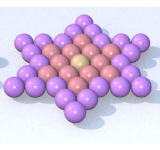

<h1 style='text-align: center;'> B. Star</h1>

<h5 style='text-align: center;'>time limit per test: 2 seconds</h5>
<h5 style='text-align: center;'>memory limit per test: 256 megabytes</h5>

  ## Input

The input contains a single integer *a* (1 ≤ *a* ≤ 18257).

## Output

Print a single integer *output* (1 ≤ *output* ≤ 2·109).

## Examples

## Input


```
2  

```
## Output


```
13
```


#### tags 

#1300 #*special #combinatorics 