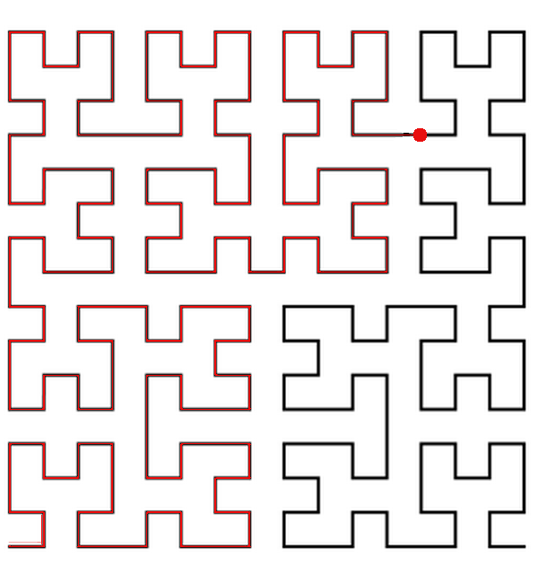

<h1 style='text-align: center;'> H. A polyline</h1>

<h5 style='text-align: center;'>time limit per test: 2 seconds</h5>
<h5 style='text-align: center;'>memory limit per test: 256 megabytes</h5>

  ## Input

The input contains two integers *a*, *b* (1 ≤ *a* ≤ 10, 0 ≤ *b* ≤ 22·*a* - 1) separated by a single space.

## Output

## Output

 two integers separated by a single space.

## Examples

## Input


```
1 0  

```
## Output


```
0 0  

```
## Input


```
2 15  

```
## Output


```
3 0  

```
## Input


```
4 160  

```
## Output


```
12 12  

```


#### tags 

#1700 #*special #implementation 