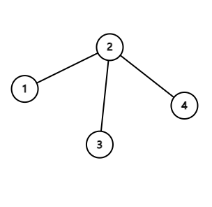
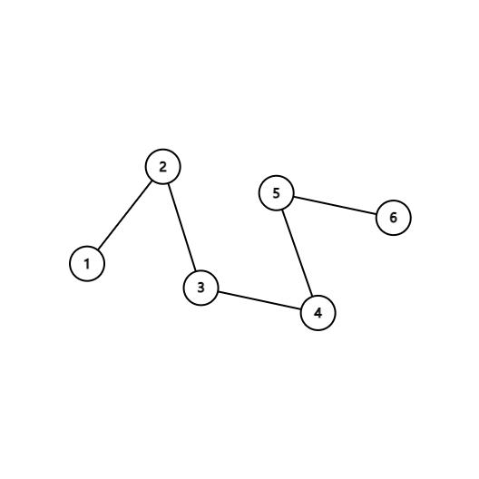
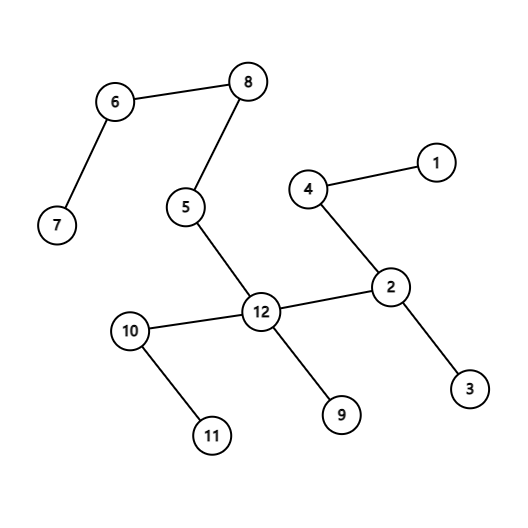

<h1 style='text-align: center;'> D. Recover the Tree</h1>

<h5 style='text-align: center;'>time limit per test: 3 seconds</h5>
<h5 style='text-align: center;'>memory limit per test: 256 megabytes</h5>

Rhodoks has a tree with $n$ vertices, but he doesn't remember its structure. The vertices are indexed from $1$ to $n$.

A segment $[l,r]$ ($1 \leq l \leq r \leq n$) is good if the vertices with indices $l$, $l + 1$, ..., $r$ form a connected component in Rhodoks' tree. Otherwise, it is bad.

For example, if the tree is the one in the picture, then only the segment $[3,4]$ is bad while all the other segments are good.

  For each of the $\frac{n(n+1)}{2}$ segments, Rhodoks remembers whether it is good or bad. Can you help him recover the tree? If there are multiple solutions, print any.

It is guaranteed that the there is at least one tree satisfying Rhodoks' description. 

## Input

Each test contains multiple test cases. The first line contains the number of test cases $t$ ($1 \leq t \leq 1000$). The description of the test cases follows.

The first line of each test case contains an integer $n$ ($1 \leq n \leq 2000$) — the number of vertices in the tree.

Then $n$ lines follow. The $i$-th of these lines contains a string $good_i$ of length $n+1-i$ consisting of 0 and 1. If the segment $[i,i+j-1]$ is good then the $j$-th character of $good_i$ is 1, otherwise $j$-th character of $good_i$ is 0.

It is guaranteed that the there is at least one tree consistent with the given data. 

It is guaranteed that the sum of $n$ over all test cases does not exceed $2000$.

## Output

For each test case, print $n-1$ lines describing the tree you recover. 

The $i$-th line should contain two integers $u_i$ and $v_i$ ($1 \leq u_i,v_i \leq n$), denoting an edge between vertices $u_i$ and $v_i$.

If there are multiple solutions, print any.

## Example

## Input


```

341111111101611111111111111111111112100100000001111000000011000000000100000000100100011110000100000100001001111101
```
## Output


```

1 2
2 3
2 4
1 2
2 3
3 4
4 5
5 6
2 3
6 7
10 11
2 4
6 8
10 12
1 4
5 8
9 12
5 12
2 12

```
## Note

The first test case is explained in the statement.

In the second test case, one possible tree is as follows:

  In the third test case, one possible tree is as follows:

  

#### tags 

#3400 #constructive_algorithms #trees 