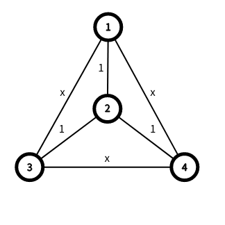

<h1 style='text-align: center;'> F. Triameter</h1>

<h5 style='text-align: center;'>time limit per test: 4.5 seconds</h5>
<h5 style='text-align: center;'>memory limit per test: 768 megabytes</h5>

 — What is my mission?  — To count graph diameters.You and Your SubmissionA tree is a connected undirected graph without cycles. A weighted tree has a weight assigned to each edge. The degree of a vertex is the number of edges connected to this vertex.

You are given a weighted tree with $n$ vertices, each edge has a weight of $1$. Let $L$ be the set of vertices with degree equal to $1$. 

You have to answer $q$ independent queries. In the $i$-th query:

1. You are given a positive integer $x_i$.
2. For all $u,v \in L$ such that $u < v$, add edge $(u, v)$ with weight $x_i$ to the graph (initially the given tree).
3. Find the diameter of the resulting graph.

The diameter of a graph is equal to $\max\limits_{1 \le u < v \le n}{\operatorname{d}(u, v)}$, where $\operatorname{d}(u, v)$ is the length of the shortest path between vertex $u$ and vertex $v$.

## Input

The first line contains a single integer $n$ ($3 \le n \le 10^6$).

The second line contains $n - 1$ integers $p_2,p_3,\ldots,p_n$ ($1 \le p_i < i$) indicating that there is an edge between vertices $i$ and $p_i$. It is guaranteed that the given edges form a tree.

The third line contains a single integer $q$ ($1 \le q \le 10$).

The fourth line contains $q$ integers $x_1,x_2,\ldots,x_q$ ($1 \le x_i \le n$). All $x_i$ are distinct.

## Output

Print $q$ integers in a single line — the answers to the queries.

## Examples

## Input


```

4
1 2 2
4
1 2 3 4

```
## Output


```

1 2 2 2 

```
## Input


```

7
1 2 3 4 2 1
7
2 1 3 7 5 6 4

```
## Output


```

3 3 4 5 5 5 4 

```
## Input


```

3
1 2
1
1

```
## Output


```

1 

```
## Note

The graph in the first test after adding the edges: 

  

#### tags 

#3200 #binary_search #data_structures #dfs_and_similar #trees 