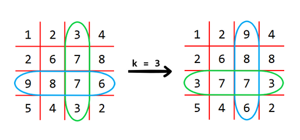
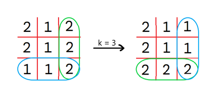
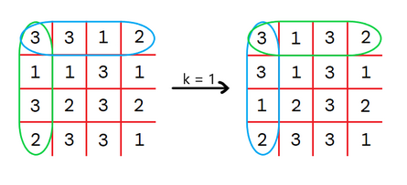
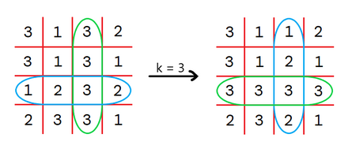

<h1 style='text-align: center;'> E. Cross Swapping</h1>

<h5 style='text-align: center;'>time limit per test: 1 second</h5>
<h5 style='text-align: center;'>memory limit per test: 256 megabytes</h5>

You are given a square matrix $A$ of size $n \times n$ whose elements are integers. We will denote the element on the intersection of the $i$-th row and the $j$-th column as $A_{i,j}$.

You can perform operations on the matrix. In each operation, you can choose an integer $k$, then for each index $i$ ($1 \leq i \leq n$), swap $A_{i, k}$ with $A_{k, i}$. ## Note

 that cell $A_{k, k}$ remains unchanged.

For example, for $n = 4$ and $k = 3$, this matrix will be transformed like this:

  The operation $k = 3$ swaps the blue row with the green column. You can perform this operation any number of times. Find the lexicographically smallest matrix$^\dagger$ you can obtain after performing arbitrary number of operations.

${}^\dagger$ For two matrices $A$ and $B$ of size $n \times n$, let $a_{(i-1) \cdot n + j} = A_{i,j}$ and $b_{(i-1) \cdot n + j} = B_{i,j}$. Then, the matrix $A$ is lexicographically smaller than the matrix $B$ when there exists an index $i$ ($1 \leq i \leq n^2$) such that $a_i < b_i$ and for all indices $j$ such that $1 \leq j < i$, $a_j = b_j$.

## Input

The first line contains a single integer $t$ ($1 \leq t \leq 10^5$) — the number of test cases.

The first line of each test case contains a single integer $n$ ($1 \leq n \leq 1000$) — the size of the matrix.

The $i$-th line of the next $n$ lines contains $n$ integers $A_{i, 1}, A_{i, 2}, \dots, A_{i, n}$ ($1 \le A_{i, j} \le 10^9$) — description of the matrix $A$.

It is guaranteed that the sum of $n^2$ over all test cases does not exceed $10^6$.

## Output

For each test case, print $n$ lines with $n$ integers each — the lexicographically smallest matrix.

## Example

## Input


```

232 1 22 1 21 1 243 3 1 21 1 3 13 2 3 22 3 3 1
```
## Output


```

2 1 1
2 1 1
2 2 2
3 1 1 2
3 1 2 1
3 3 3 3
2 3 2 1

```
## Note

## Note

 that in every picture below the matrix is transformed in such a way that the blue rows are swapped with the green columns.

In the first test case, we can perform $1$ operation for $k = 3$. The matrix will be transformed as below: 

   In the second test case, we can perform $2$ operations for $k = 1$ and $k = 3$:      

#### tags 

#2400 #2-sat #data_structures #dsu #greedy #matrices 