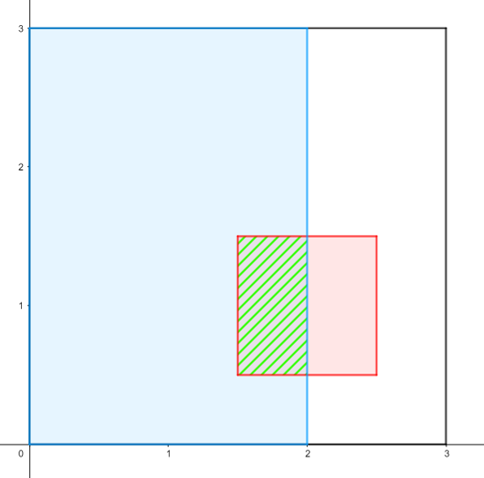
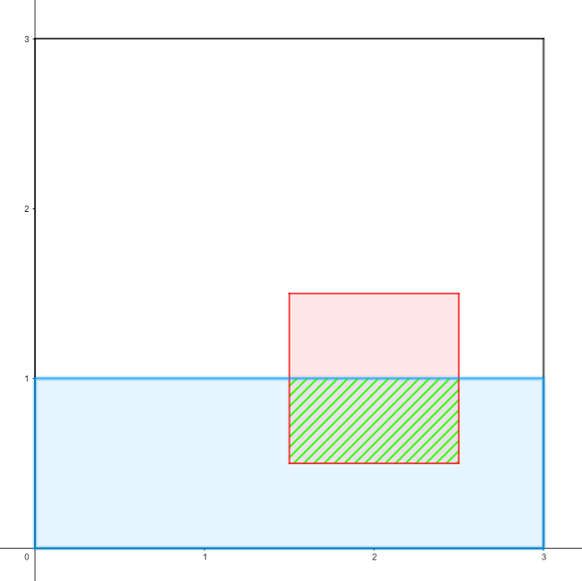

<h1 style='text-align: center;'> F. Crop Squares</h1>

<h5 style='text-align: center;'>time limit per test: 1 second</h5>
<h5 style='text-align: center;'>memory limit per test: 256 megabytes</h5>

This is an interactive problem.

Farmer Stanley grows corn on a rectangular field of size $ n \times m $ meters with corners in points $(0, 0)$, $(0, m)$, $(n, 0)$, $(n, m)$. This year the harvest was plentiful and corn covered the whole field.

The night before harvest aliens arrived and poisoned the corn in a single $1 \times 1$ square with sides parallel to field borders. The corn inside the square must not be eaten, but you cannot distinguish it from ordinary corn by sight. Stanley can only collect a sample of corn from an arbitrary polygon and bring it to the laboratory, where it will be analyzed and Stanley will be told the amount of corn in the sample that was poisoned. Since the harvest will soon deteriorate, such a study can be carried out no more than $5$ times.

More formally, it is allowed to make no more than $5$ queries, each of them calculates the area of intersection of a chosen polygon with a square of poisoned corn. It is necessary to find out the coordinates of the lower-left corner of the drawn square (the vertex of the square with the smallest $x$ and $y$ coordinates).

## Input

First line contains two integers $n$ and $m$ ($1 \le n, m \le 100$) — field sizes.

## Interaction

In order to query the area of intersection of a polygon with $k$ ($3 \le k \le 1000$) vertices at points with coordinates $(x_1, y_1),\; \dots ,\;(x_k, y_k)$ with a square of poisoned corn print $k+1$ lines. In the first of these lines print "? k". In the $i$-th of the next $k$ lines print two real numbers $x_i$ and $y_i$ ($|x_i|, |y_i| \le 10^4$) with at most $15$ digits after decimal place.

The polygon must have strictly positive area and contain no self-intersections.

In response to this query you will receive a real number $s$ ($0 \le s \le 1$) with $15$ digits after decimal place — the area of intersection of the square with the given polygon. If the polygon is invalid, there is no guarantee on the valid response.

When you have identified the drawn square, print on a separate line "! x y", where $x$ and $y$ are real numbers with at most $15$ digits after decimal place representing the coordinates of its lower-left corner ($0 \le x \le n - 1$, $0 \le y \le m - 1$), and then you have to terminate your program.

Your answer will be considered correct if its absolute or relative error on both coordinates does not exceed $10^{-6}$. Formally let your answer be $a$, jury answer be $b$. Your answer will be considered correct if $\frac{|a-b|}{max(1,|b|)} \le 10^{-6}$.

After printing a query do not forget to output end of line and flush the output. Otherwise, you will get Idleness limit exceeded. To do this, use: 

* fflush(stdout) or cout.flush() in C++;
* System.out.flush() in Java;
* flush(output) in Pascal;
* stdout.flush() in Python;
* see documentation for other languages.

Hacks

To make a hack, use the following test format.

The first line of the input should contain two integers $n$ and $m$ ($1 \le n,m \le 100$) — field sizes.

The second line should contain two real numbers $x$ ($0 \le x \le n - 1$) and $y$ ($0 \le y \le m - 1$) — coordinates of the lower-left corner of the square of poisoned corn.

## Example

## Input


```

3 3


0.5


0.5
```
Output
```

? 4
0 0
2 0
2 3
0 3

? 4
0 0
0 1
3 1
3 0

! 1.5 0.5
```
## Note

In the first test from the statement, the aliens poisoned a square of corn with vertices at points with coordinates $(1.5, 0.5)$, $(1.5, 1.5)$, $(2.5, 1.5)$, $(2.5, 0.5)$. In the picture, it is red, the polygon selected in the query is blue, and their intersection is green.

Picture for the first query:

  Picture for the second query:

  

#### tags 

#2700 #constructive_algorithms #geometry #interactive #math 