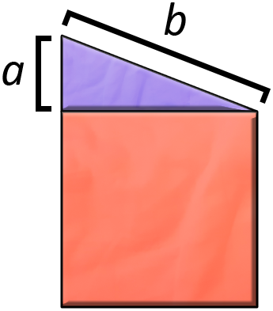

<h1 style='text-align: center;'> G. Garage</h1>

<h5 style='text-align: center;'>time limit per test: 1 second</h5>
<h5 style='text-align: center;'>memory limit per test: 128 megabytes</h5>

Pak Chanek plans to build a garage. He wants the garage to consist of a square and a right triangle that are arranged like the following illustration.

  Define $a$ and $b$ as the lengths of two of the sides in the right triangle as shown in the illustration. An integer $x$ is suitable if and only if we can construct a garage with assigning positive integer values for the lengths $a$ and $b$ ($a<b$) so that the area of the square at the bottom is exactly $x$. As a good friend of Pak Chanek, you are asked to help him find the $N$-th smallest suitable number.

## Input

The only line contains a single integer $N$ ($1 \leq N \leq 10^9$).

## Output

An integer that represents the $N$-th smallest suitable number.

## Example

## Input


```

3

```
## Output


```

7

```
## Note

The $3$-rd smallest suitable number is $7$. A square area of $7$ can be obtained by assigning $a=3$ and $b=4$.


#### tags 

#1500 #binary_search #geometry #math 