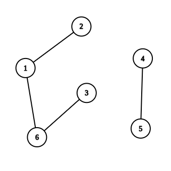

<h1 style='text-align: center;'> C. Jatayu's Balanced Bracket Sequence</h1>

<h5 style='text-align: center;'>time limit per test: 2 seconds</h5>
<h5 style='text-align: center;'>memory limit per test: 256 megabytes</h5>

Last summer, Feluda gifted Lalmohan-Babu a balanced bracket sequence $s$ of length $2 n$.

Topshe was bored during his summer vacations, and hence he decided to draw an undirected graph of $2 n$ vertices using the balanced bracket sequence $s$. For any two distinct vertices $i$ and $j$ ($1 \le i < j \le 2 n$), Topshe draws an edge (undirected and unweighted) between these two nodes if and only if the subsegment $s[i \ldots j]$ forms a balanced bracket sequence.

Determine the number of connected components in Topshe's graph.

See the ## Note

s section for definitions of the underlined terms.

## Input

Each test contains multiple test cases. The first line contains a single integer $t$ ($1 \le t \le 10^5$) — the number of test cases. Description of the test cases follows.

The first line of each test case contains a single integer $n$ ($1 \le n \le 10^5$) — the number of opening brackets in string $s$.

The second line of each test case contains a string $s$ of length $2 n$ — a balanced bracket sequence consisting of $n$ opening brackets "(", and $n$ closing brackets ")".

It is guaranteed that the sum of $n$ over all test cases does not exceed $10^5$.

## Output

For each test case, output a single integer — the number of connected components in Topshe's graph.

## Example

## Input


```

41()3()(())3((()))4(())(())
```
## Output


```

1
2
3
3

```
## Note

Sample explanation:

In the first test case, the graph constructed from the bracket sequence (), is just a graph containing nodes $1$ and $2$ connected by a single edge. 

In the second test case, the graph constructed from the bracket sequence ()(()) would be the following (containing two connected components):

  Definition of Underlined Terms:

* A sequence of brackets is called balanced if one can turn it into a valid math expression by adding characters $+$ and $1$. For example, sequences (())(), (), and (()(())) are balanced, while )(, ((), and (()))( are not.
* The subsegment $s[l \ldots r]$ denotes the sequence $[s_l, s_{l + 1}, \ldots, s_r]$.
* A connected component is a set of vertices $X$ such that for every two vertices from this set there exists at least one path in the graph connecting these vertices, but adding any other vertex to $X$ violates this rule.


#### tags 

#1300 #data_structures #dsu #graphs #greedy 