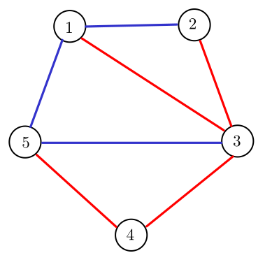
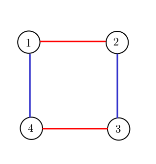

<h1 style='text-align: center;'> D. Edge Split</h1>

<h5 style='text-align: center;'>time limit per test: 2 seconds</h5>
<h5 style='text-align: center;'>memory limit per test: 256 megabytes</h5>

You are given a connected, undirected and unweighted graph with $n$ vertices and $m$ edges. Notice the limit on the number of edges: $m \le n + 2$.

Let's say we color some of the edges red and the remaining edges blue. Now consider only the red edges and count the number of connected components in the graph. Let this value be $c_1$. Similarly, consider only the blue edges and count the number of connected components in the graph. Let this value be $c_2$.

Find an assignment of colors to the edges such that the quantity $c_1+c_2$ is minimised.

## Input

Each test contains multiple test cases. The first line contains a single integer $t$ ($1 \le t \le 10^5$) — the number of test cases. Description of the test cases follows.

The first line of each test case contains two integers $n$ and $m$ ($2 \le n \le 2 \cdot 10^5$; $n-1 \leq m \leq \min{\left(n+2,\frac{n \cdot (n-1)}{2}\right)}$) — the number of vertices and the number of edges respectively.

$m$ lines follow. The $i$-th line contains two integers $u_i$ and $v_i$ ($1 \le u_i,v_i \le n$, $u_i \ne v_i$) denoting that the $i$-th edge goes between vertices $u_i$ and $v_i$. The input is guaranteed to have no multiple edges or self loops. The graph is also guaranteed to be connected.

It is guaranteed that the sum of $n$ over all test cases does not exceed $10^6$. It is guaranteed that the sum of $m$ over all test cases does not exceed $2 \cdot 10^6$.

## Output

For each test case, output a binary string of length $m$. The $i$-th character of the string should be 1 if the $i$-th edge should be colored red, and 0 if it should be colored blue. If there are multiple ways to assign colors to edges that give the minimum answer, you may output any.

## Example

## Input


```

45 71 22 33 44 55 11 33 54 41 22 31 43 46 71 21 33 44 51 45 66 22 11 2
```
## Output


```

0111010
1001
0001111
0

```
## Note

* The corresponding graph of the first test case is:  $c_1 + c_2 = 1 + 2 = 3$
* The corresponding graph of the second test case is:  $c_1 + c_2 = 2 + 2 = 4$


#### tags 

#2000 #brute_force #constructive_algorithms #dfs_and_similar #dsu #graphs #probabilities #trees 