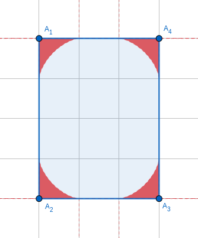

<h1 style='text-align: center;'> H. Mainak and the Bleeding Polygon</h1>

<h5 style='text-align: center;'>time limit per test: 1 second</h5>
<h5 style='text-align: center;'>memory limit per test: 256 megabytes</h5>

Mainak has a convex polygon $\mathcal P$ with $n$ vertices labelled as $A_1, A_2, \ldots, A_n$ in a counter-clockwise fashion. The coordinates of the $i$-th point $A_i$ are given by $(x_i, y_i)$, where $x_i$ and $y_i$ are both integers.

Further, it is known that the interior angle at $A_i$ is either a right angle or a proper obtuse angle. Formally it is known that: 

* $90 ^ \circ \le \angle A_{i - 1}A_{i}A_{i + 1} < 180 ^ \circ$, $\forall i \in \{1, 2, \ldots, n\}$ where we conventionally consider $A_0 = A_n$ and $A_{n + 1} = A_1$.

Mainak's friend insisted that all points $Q$ such that there exists a chord of the polygon $\mathcal P$ passing through $Q$ with length not exceeding $1$, must be coloured $\color{red}{\text{red}}$. 

Mainak wants you to find the area of the coloured region formed by the $\color{red}{\text{red}}$ points.

Formally, determine the area of the region $\mathcal S = \{Q \in \mathcal{P}$ | $Q \text{ is coloured } \color{red}{\text{red}}\}$.

Recall that a chord of a polygon is a line segment between two points lying on the boundary (i.e. vertices or points on edges) of the polygon. 

## Input

The first line contains an integer $n$ ($4 \le n \le 5000$) — the number of vertices of a polygon $\mathcal P$.

The $i$-th line of the next $n$ lines contain two integers $x_i$ and $y_i$ ($-10^9 \le x_i, y_i \le 10^9$) — the coordinates of $A_i$.

Additional constraint on the input: The vertices form a convex polygon and are listed in counter-clockwise order. It is also guaranteed that all interior angles are in the range $[90^\circ ; 180^\circ )$.

## Output

Print the area of the region coloured in $\color{red}{\text{red}}$.

Your answer is considered correct if its absolute or relative error does not exceed $10^{-4}$.

Formally, let your answer be $a$, and the jury's answer be $b$. Your answer is accepted if and only if $\frac{|a - b|}{\max{(1, |b|)}} \le 10^{-4}$.

## Examples

## Input


```

4
4 5
4 1
7 1
7 5

```
## Output


```

1.17809724510
```
## Input


```

5
-3 3
3 1
4 2
-1 9
-2 9

```
## Output


```

1.07823651333
```
## Note

In the first example, the polygon $\mathcal P$ can be visualised on the Cartesian Plane as:

  

#### tags 

#3500 #binary_search #geometry #implementation #math 