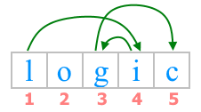

<h1 style='text-align: center;'> C. Jumping on Tiles</h1>

<h5 style='text-align: center;'>time limit per test: 1 second</h5>
<h5 style='text-align: center;'>memory limit per test: 256 megabytes</h5>

Polycarp was given a row of tiles. Each tile contains one lowercase letter of the Latin alphabet. The entire sequence of tiles forms the string $s$.

In other words, you are given a string $s$ consisting of lowercase Latin letters.

Initially, Polycarp is on the first tile of the row and wants to get to the last tile by jumping on the tiles. Jumping from $i$-th tile to $j$-th tile has a cost equal to $|index(s_i) - index(s_j)|$, where $index(c)$ is the index of the letter $c$ in the alphabet (for example, $index($'a'$)=1$, $index($'b'$)=2$, ..., $index($'z'$)=26$) .

Polycarp wants to get to the $n$-th tile for the minimum total cost, but at the same time make maximum number of jumps.

In other words, among all possible ways to get to the last tile for the minimum total cost, he will choose the one with the maximum number of jumps.

Polycarp can visit each tile at most once.

Polycarp asks you to help — print the sequence of indices of string $s$ on which he should jump.

## Input

The first line of the input contains an integer $t$ ($1 \le t \le 10^4$) — the number of test cases in the test.

Each test case is given by the string $s$ ($2 \le |s| \le 2 \cdot 10^5$), where $|s|$ — is the length of string $s$. The string $s$ consists of lowercase Latin letters.

It is guaranteed that the sum of string lengths $s$ over all test cases does not exceed $2 \cdot 10^5$.

## Output

The answer to each test case consists of two lines.

In the first line print two integers $cost$, $m$, where $cost$ is the minimum total cost of the path, and $m$ is the maximum number of visited tiles Polycarp can make to get to $n$-th tiles for the minimum total cost $cost$ (i.e. the number of jumps is $m-1$).

In the next line print $m$ different numbers $j_1, j_2, \dots, j_m$ ($1 \le j_i \le |s|$) — the sequence of indices of the tiles Polycarp will jump on. The first number in the sequence must be $1$ (that is, $j_1=1$) and the last number must be the value of $|s|$ (that is, $j_m=|s|$).

If there are multiple answers, print any of them.

## Example

## Input


```

6logiccodeforcesbcaaaaaaaaaaaaadbaadabadto
```
## Output


```

9 4
1 4 3 5
16 10
1 8 3 4 9 5 2 6 7 10
1 2
1 3
0 11
1 8 10 4 3 5 7 2 9 6 11
3 10
1 9 5 4 7 3 8 6 2 10
5 2
1 2

```
## Note

In the first test case, the required path corresponds to the picture:

  In this case, the minimum possible total cost of the path is achieved. Since $index($'l'$)=12$, $index($'o'$)=15$, $index($'g'$)=7$, $index($'i'$)=9$, $index($'c'$)=3$, then the total cost of the path is $|12-9|+|9-7|+|7-3|=3+2+4=9$.


#### tags 

#1100 #constructive_algorithms #strings 