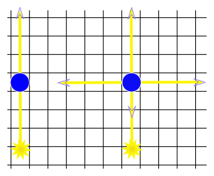
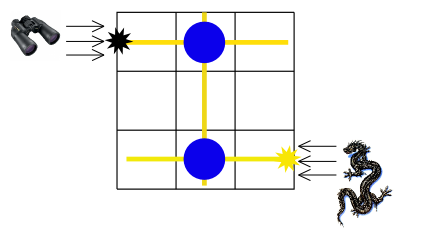

<h1 style='text-align: center;'> B. Chamber of Secrets</h1>

<h5 style='text-align: center;'>time limit per test: 2 seconds</h5>
<h5 style='text-align: center;'>memory limit per test: 256 megabytes</h5>

"The Chamber of Secrets has been opened again" — this news has spread all around Hogwarts and some of the students have been petrified due to seeing the basilisk. Dumbledore got fired and now Harry is trying to enter the Chamber of Secrets. These aren't good news for Lord Voldemort. The problem is, he doesn't want anybody to be able to enter the chamber. The Dark Lord is going to be busy sucking life out of Ginny.

The Chamber of Secrets is an *n* × *m* rectangular grid in which some of the cells are columns. A light ray (and a basilisk's gaze) passes through the columns without changing its direction. But with some spell we can make a column magic to reflect the light ray (or the gaze) in all four directions when it receives the ray. This is shown in the figure below.

   The left light ray passes through a regular column, and the right ray — through the magic column.  The basilisk is located at the right side of the lower right cell of the grid and is looking to the left (in the direction of the lower left cell). According to the legend, anyone who meets a basilisk's gaze directly dies immediately. But if someone meets a basilisk's gaze through a column, this person will get petrified. We know that the door to the Chamber is located on the left side of the upper left corner of the grid and anyone who wants to enter will look in the direction of its movement (in the direction of the upper right cell) from that position.

   This figure illustrates the first sample test.  Given the dimensions of the chamber and the location of regular columns, Lord Voldemort has asked you to find the minimum number of columns that we need to make magic so that anyone who wants to enter the chamber would be petrified or just declare that it's impossible to secure the chamber.

## Input

The first line of the input contains two integer numbers *n* and *m* (2 ≤ *n*, *m* ≤ 1000). Each of the next *n* lines contains *m* characters. Each character is either "." or "#" and represents one cell of the Chamber grid. It's "." if the corresponding cell is empty and "#" if it's a regular column.

## Output

Print the minimum number of columns to make magic or -1 if it's impossible to do.

## Examples

## Input


```
3 3  
.#.  
...  
.#.  

```
## Output


```
2  

```
## Input


```
4 3  
##.  
...  
.#.  
.#.  

```
## Output


```
2  

```
## Note

The figure above shows the first sample test. In the first sample we should make both columns magic. The dragon figure represents the basilisk and the binoculars represent the person who will enter the Chamber of secrets. The black star shows the place where the person will be petrified. Yellow lines represent basilisk gaze moving through columns.


#### tags 

#1800 #dfs_and_similar #shortest_paths 