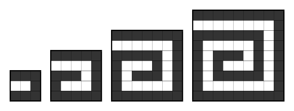

<h1 style='text-align: center;'> C. Spiral Maximum</h1>

<h5 style='text-align: center;'>time limit per test: 3 seconds</h5>
<h5 style='text-align: center;'>memory limit per test: 256 megabytes</h5>

Let's consider a *k* × *k* square, divided into unit squares. Please note that *k* ≥ 3 and is odd. We'll paint squares starting from the upper left square in the following order: first we move to the right, then down, then to the left, then up, then to the right again and so on. We finish moving in some direction in one of two cases: either we've reached the square's border or the square following after the next square is already painted. We finish painting at the moment when we cannot move in any direction and paint a square. The figure that consists of the painted squares is a spiral.

   The figure shows examples of spirals for *k* = 3, 5, 7, 9.  You have an *n* × *m* table, each of its cells contains a number. Let's consider all possible spirals, formed by the table cells. It means that we consider all spirals of any size that don't go beyond the borders of the table. Let's find the sum of the numbers of the cells that form the spiral. You have to find the maximum of those values among all spirals.

## Input

The first line contains two integers *n* and *m* (3 ≤ *n*, *m* ≤ 500) — the sizes of the table.

Each of the next *n* lines contains *m* space-separated integers: the *j*-th number in the *i*-th line *a**ij* ( - 1000 ≤ *a**ij* ≤ 1000) is the number recorded in the *j*-th cell of the *i*-th row of the table.

## Output

Print a single number — the maximum sum of numbers among all spirals.

## Examples

## Input


```
6 5  
0 0 0 0 0  
1 1 1 1 1  
0 0 0 0 1  
1 1 1 0 1  
1 0 0 0 1  
1 1 1 1 1  

```
## Output


```
17
```
## Input


```
3 3  
1 1 1  
1 0 0  
1 1 1  

```
## Output


```
6
```
## Input


```
6 6  
-3 2 0 1 5 -1  
4 -1 2 -3 0 1  
-5 1 2 4 1 -2  
0 -2 1 3 -1 2  
3 1 4 -3 -2 0  
-1 2 -1 3 1 2  

```
## Output


```
13
```
## Note

In the first sample the spiral with maximum sum will cover all 1's of the table.

In the second sample the spiral may cover only six 1's.


#### tags 

#1900 #brute_force #dp 