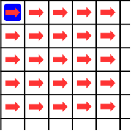
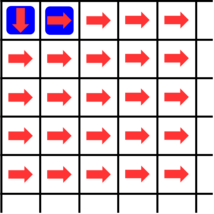
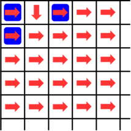

<h1 style='text-align: center;'> E. Conveyor</h1>

<h5 style='text-align: center;'>time limit per test: 3 seconds</h5>
<h5 style='text-align: center;'>memory limit per test: 256 megabytes</h5>

There is a conveyor with $120$ rows and $120$ columns. Each row and column is numbered from $0$ to $119$, and the cell in $i$-th row and $j$-th column is denoted as $(i, j)$. The top leftmost cell is $(0, 0)$. Each cell has a belt, and all belts are initially facing to the right.

Initially, a slime ball is on the belt of $(0, 0)$, and other belts are empty. Every second, the state of the conveyor changes as follows: 

* All slime balls on the conveyor move one cell in the direction of the belt at the same time. If there is no cell in the moved position, the slime gets out of the conveyor, and if two slime balls move to the same cell, they merge into one.
* All belts with slime ball in the previous second change direction at the same time: belts facing to the right become facing to the down, and vice versa.
* A new slime ball is placed on cell $(0, 0)$.

There are $q$ queries, each being three integers $t$, $x$, and $y$. You have to find out if there is a slime at the cell $(x, y)$ after $t$ seconds from the start. Can you do it?

## Input

The first line contains one integer $q$ ($1 \le q \le 10^4$) — the number of queries.

The only line of each query contains three integers $t$, $x$, and $y$ ($0 \le t \le 10^{18}$, $0 \le x, y < 120$).

## Output

Print the answer for each test case, one per line. If there is a slime ball in the cell $(x, y)$ after $t$ seconds from the initial state, print "YES". Otherwise, print "NO".

## Example

## Input


```

61 1 05 1 30 0 02 4 52 0 21547748756 100 111
```
## Output


```

NO
YES
YES
NO
YES
YES

```
## Note

The state of conveyor with $t = 0$. Red arrow represents the direction of each belt, and blue figure represents slime.



The state of conveyor with $t = 1$.



The state of conveyor with $t = 2$.




#### tags 

#2700 #constructive_algorithms #dp #math 