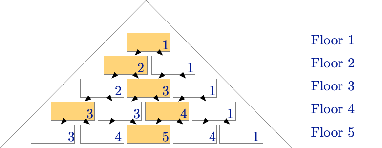
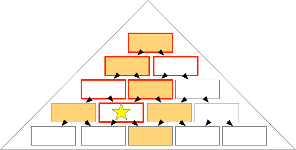
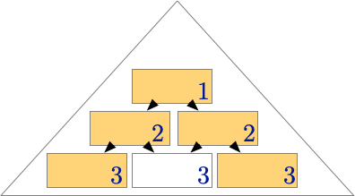

<h1 style='text-align: center;'> B. Bright, Nice, Brilliant</h1>

<h5 style='text-align: center;'>time limit per test: 1 second</h5>
<h5 style='text-align: center;'>memory limit per test: 256 megabytes</h5>

There is a pyramid which consists of $n$ floors. The floors are numbered from top to bottom in increasing order. In the pyramid, the $i$-th floor consists of $i$ rooms.

Denote the $j$-th room on the $i$-th floor as $(i,j)$. For all positive integers $i$ and $j$ such that $1 \le j \le i < n$, there are $2$ one-way staircases which lead from $(i,j)$ to $(i+1,j)$ and from $(i,j)$ to $(i+1,j+1)$ respectively.

In each room you can either put a torch or leave it empty. Define the brightness of a room $(i, j)$ to be the number of rooms with a torch from which you can reach the room $(i, j)$ through a non-negative number of staircases.

For example, when $n=5$ and torches are placed in the rooms $(1,1)$, $(2,1)$, $(3,2)$, $(4,1)$, $(4,3)$, and $(5,3)$, the pyramid can be illustrated as follows:

  In the above picture, rooms with torches are colored in yellow, and empty rooms are white. The blue numbers in the bottom-right corner indicate the brightness of the rooms.

The room $(4,2)$ (the room with a star) has brightness $3$. In the picture below, the rooms from where you can reach $(4,2)$ have red border. The brightness is $3$ since there are three torches among these rooms.

  The pyramid is called nice if and only if for all floors, all rooms in the floor have the same brightness.

Define the brilliance of a nice pyramid to be the sum of brightness over the rooms $(1,1)$, $(2,1)$, $(3,1)$, ..., $(n,1)$.

Find an arrangement of torches in the pyramid, such that the resulting pyramid is nice and its brilliance is maximized.

We can show that an answer always exists. If there are multiple answers, output any one of them.

## Input

The first line of the input contains a single integer $t$ ($1 \le t \le 100$) — the number of test cases. The description of the test cases follows.

The only line of each test case contains a single positive integer $n$ ($1 \le n \le 500$) — the number of floors in the pyramid.

It is guaranteed that the sum of $n$ over all test cases does not exceed $500$.

## Output

For each test case, output $n$ lines, the arrangement of torches in the pyramid.

The $i$-th line should contain $i$ integers, each separated with a space. The $j$-th integer on the $i$-th line should be $1$ if room $(i,j)$ has a torch, and $0$ otherwise.

We can show that an answer always exists. If there are multiple answers, output any one of them.

## Example

## Input


```

3123
```
## Output


```

1 
1 
1 1 
1 
1 1 
1 0 1 

```
## Note

In the third test case, torches are placed in $(1,1)$, $(2,1)$, $(2,2)$, $(3,1)$, and $(3,3)$.

  The pyramid is nice as rooms on each floor have the same brightness. For example, all rooms on the third floor have brightness $3$.

The brilliance of the pyramid is $1+2+3 = 6$. It can be shown that no arrangements with $n=3$ will have a greater brilliance.


#### tags 

#800 #constructive_algorithms 