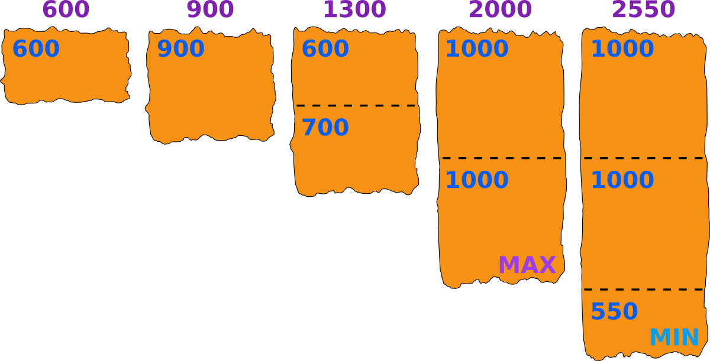

<h1 style='text-align: center;'> B. Tea with Tangerines</h1>

<h5 style='text-align: center;'>time limit per test: 1 second</h5>
<h5 style='text-align: center;'>memory limit per test: 256 megabytes</h5>

There are $n$ pieces of tangerine peel, the $i$-th of them has size $a_i$. In one step it is possible to divide one piece of size $x$ into two pieces of positive integer sizes $y$ and $z$ so that $y + z = x$.

You want that for each pair of pieces, their sizes differ strictly less than twice. In other words, there should not be two pieces of size $x$ and $y$, such that $2x \le y$. What is the minimum possible number of steps needed to satisfy the condition?

## Input

The first line of the input contains a single integer $t$ ($1 \le t \le 100$) — the number of test cases. The description of test cases follows.

The first line of each test case contains the integer $n$ ($1 \le n \le 100$).

Then one line follows, containing $n$ integers $a_1 \le a_2 \le \ldots \le a_n$ ($1 \le a_i \le 10^7$).

## Output

For each test case, output a single line containing the minimum number of steps.

## Example

## Input


```

351 2 3 4 5110335600 900 1300 2000 2550
```
## Output


```

10
0
4

```
## Note

In the first test case, we initially have a piece of size $1$, so all final pieces must have size $1$. The total number of steps is: $0 + 1 + 2 + 3 + 4 = 10$.

In the second test case, we have just one piece, so we don't need to do anything, and the answer is $0$ steps.

In the third test case, one of the possible cut options is: $600,\ 900,\ (600 | 700),\ (1000 | 1000),\ (1000 | 1000 | 550)$. You can see this option in the picture below. The maximum piece has size $1000$, and it is less than $2$ times bigger than the minimum piece of size $550$. $4$ steps are done. We can show that it is the minimum possible number of steps.

  

#### tags 

#900 #greedy #math 