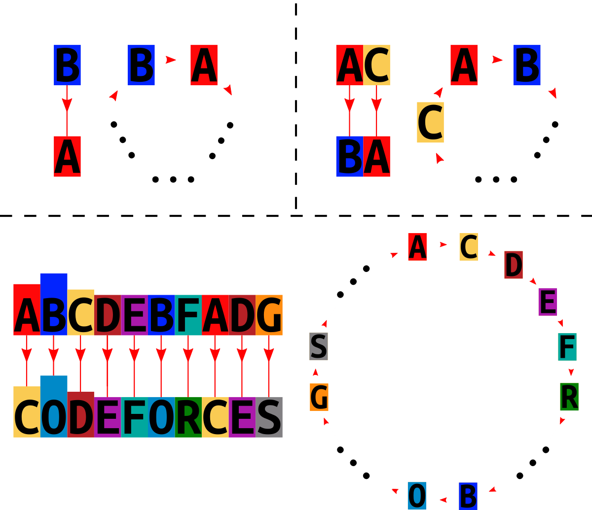

<h1 style='text-align: center;'> C. Phase Shift</h1>

<h5 style='text-align: center;'>time limit per test: 3 seconds</h5>
<h5 style='text-align: center;'>memory limit per test: 256 megabytes</h5>

There was a string $s$ which was supposed to be encrypted. For this reason, all $26$ lowercase English letters were arranged in a circle in some order, afterwards, each letter in $s$ was replaced with the one that follows in clockwise order, in that way the string $t$ was obtained. 

You are given a string $t$. Determine the lexicographically smallest string $s$ that could be a prototype of the given string $t$.

A string $a$ is lexicographically smaller than a string $b$ of the same length if and only if: 

* in the first position where $a$ and $b$ differ, the string $a$ has a letter, that appears earlier in the alphabet than the corresponding letter in $b$.

 ## Input

The first line of the input contains a single integer $t$ ($1 \le t \le 3 \cdot 10^4$) — the number of test cases. The description of test cases follows.

The first line of each test case contains one integer $n$ ($1 \le n \le 10^5$) — the length of the string $t$.

The next line contains the string $t$ of the length $n$, containing lowercase English letters.

It is guaranteed that the sum of $n$ over all test cases doesn't exceed $2 \cdot 10^5$.

## Output

For each test case, output a single line containing the lexicographically smallest string $s$ which could be a prototype of $t$.

## Example

## Input


```

51a2ba10codeforces26abcdefghijklmnopqrstuvwxyz26abcdefghijklmnopqrstuvwxzy
```
## Output


```

b
ac
abcdebfadg
bcdefghijklmnopqrstuvwxyza
bcdefghijklmnopqrstuvwxyaz

```
## Note

In the first test case, we couldn't have the string "a", since the letter a would transit to itself. Lexicographically the second string "b" is suitable as an answer.

In the second test case, the string "aa" is not suitable, since a would transit to itself. "ab" is not suitable, since the circle would be closed with $2$ letters, but it must contain all $26$. The next string "ac" is suitable.

Below you can see the schemes for the first three test cases. The non-involved letters are skipped, they can be arbitrary placed in the gaps.

  

#### tags 

#1400 #dfs_and_similar #dsu #graphs #greedy #implementation #strings 