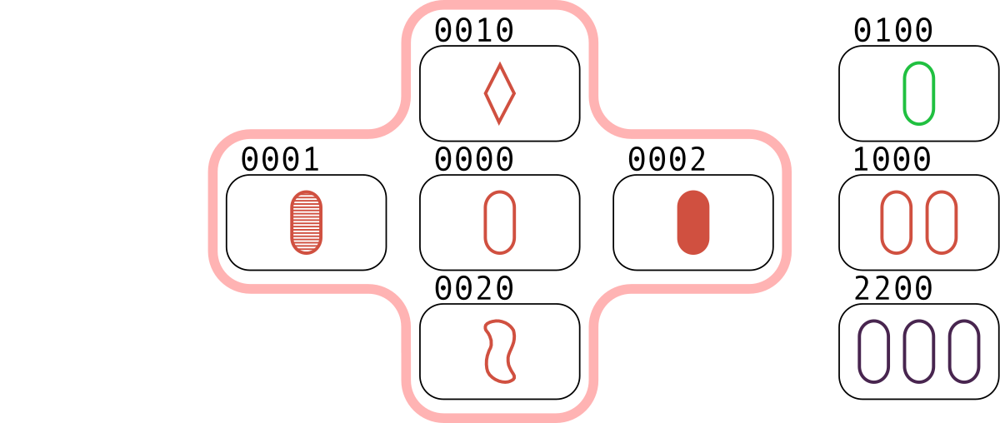
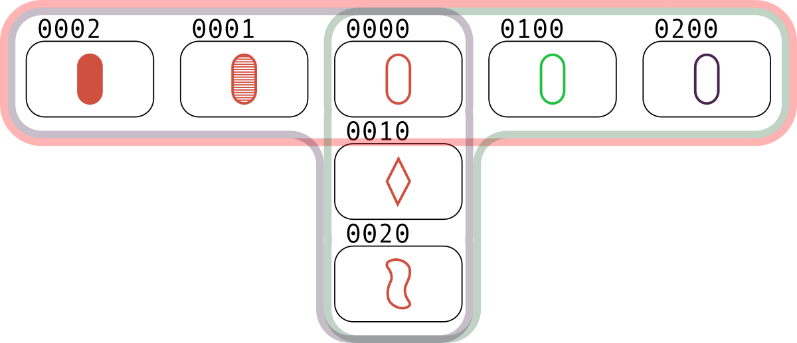
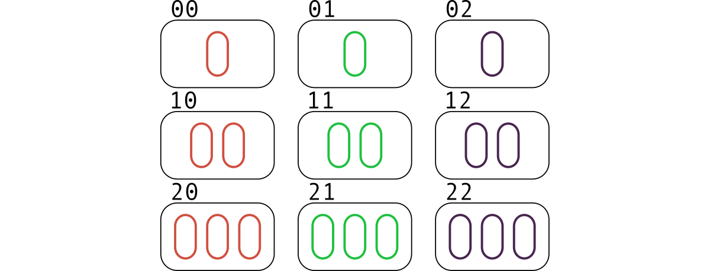

<h1 style='text-align: center;'> D. Meta-set</h1>

<h5 style='text-align: center;'>time limit per test: 4 seconds</h5>
<h5 style='text-align: center;'>memory limit per test: 256 megabytes</h5>

You like the card board game "Set". Each card contains $k$ features, each of which is equal to a value from the set $\{0, 1, 2\}$. The deck contains all possible variants of cards, that is, there are $3^k$ different cards in total.

A feature for three cards is called good if it is the same for these cards or pairwise distinct. Three cards are called a set if all $k$ features are good for them.

For example, the cards $(0, 0, 0)$, $(0, 2, 1)$, and $(0, 1, 2)$ form a set, but the cards $(0, 2, 2)$, $(2, 1, 2)$, and $(1, 2, 0)$ do not, as, for example, the last feature is not good.

A group of five cards is called a meta-set, if there is strictly more than one set among them. How many meta-sets there are among given $n$ distinct cards?

## Input

The first line of the input contains two integers $n$ and $k$ ($1 \le n \le 10^3$, $1 \le k \le 20$) — the number of cards on a table and the number of card features. The description of the cards follows in the next $n$ lines.

Each line describing a card contains $k$ integers $c_{i, 1}, c_{i, 2}, \ldots, c_{i, k}$ ($0 \le c_{i, j} \le 2$) — card features. It is guaranteed that all cards are distinct.

## Output

## Output

 one integer — the number of meta-sets.

## Examples

## Input


```

8 4
0 0 0 0
0 0 0 1
0 0 0 2
0 0 1 0
0 0 2 0
0 1 0 0
1 0 0 0
2 2 0 0

```
## Output


```

1

```
## Input


```

7 4
0 0 0 0
0 0 0 1
0 0 0 2
0 0 1 0
0 0 2 0
0 1 0 0
0 2 0 0

```
## Output


```

3

```
## Input


```

9 2
0 0
0 1
0 2
1 0
1 1
1 2
2 0
2 1
2 2

```
## Output


```

54

```
## Input


```

20 4
0 2 0 0
0 2 2 2
0 2 2 1
0 2 0 1
1 2 2 0
1 2 1 0
1 2 2 1
1 2 0 1
1 1 2 2
1 1 0 2
1 1 2 1
1 1 1 1
2 1 2 0
2 1 1 2
2 1 2 1
2 1 1 1
0 1 1 2
0 0 1 0
2 2 0 0
2 0 0 2

```
## Output


```

0

```
## Note

Let's draw the cards indicating the first four features. The first feature will indicate the number of objects on a card: $1$, $2$, $3$. The second one is the color: red, green, purple. The third is the shape: oval, diamond, squiggle. The fourth is filling: open, striped, solid.

You can see the first three tests below. For the first two tests, the meta-sets are highlighted.

In the first test, the only meta-set is the five cards $(0000,\ 0001,\ 0002,\ 0010,\ 0020)$. The sets in it are the triples $(0000,\ 0001,\ 0002)$ and $(0000,\ 0010,\ 0020)$. Also, a set is the triple $(0100,\ 1000,\ 2200)$ which does not belong to any meta-set. 

  In the second test, the following groups of five cards are meta-sets: $(0000,\ 0001,\ 0002,\ 0010,\ 0020)$, $(0000,\ 0001,\ 0002,\ 0100,\ 0200)$, $(0000,\ 0010,\ 0020,\ 0100,\ 0200)$. 

  In there third test, there are $54$ meta-sets. 

  

#### tags 

#1700 #brute_force #combinatorics #data_structures #hashing #math 