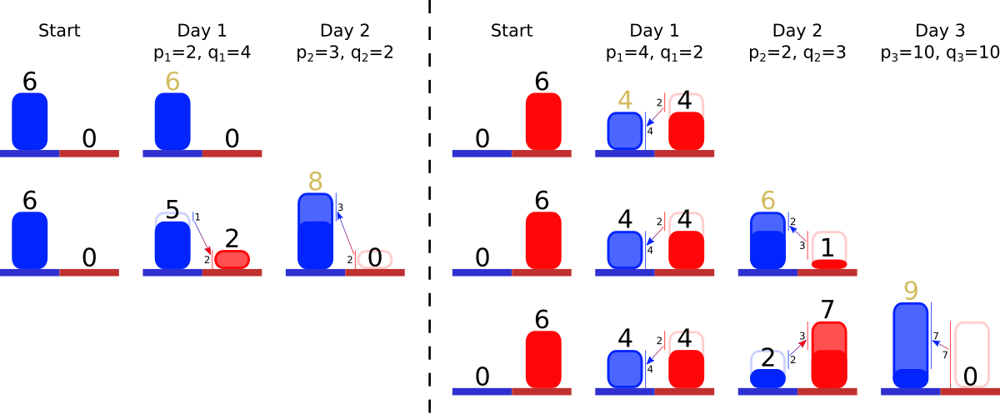

<h1 style='text-align: center;'> F. Pebbles and Beads</h1>

<h5 style='text-align: center;'>time limit per test: 4 seconds</h5>
<h5 style='text-align: center;'>memory limit per test: 256 megabytes</h5>

There are two currencies: pebbles and beads. Initially you have $a$ pebbles, $b$ beads.

There are $n$ days, each day you can exchange one currency for another at some exchange rate.

On day $i$, you can exchange $-p_i \leq x \leq p_i$ pebbles for $-q_i \leq y \leq q_i$ beads or vice versa. It's allowed not to perform an exchange at all. Meanwhile, if you perform an exchange, the proportion $x \cdot q_i = -y \cdot p_i$ must be fulfilled. Fractional exchanges are allowed.

You can perform no more than one such exchange in one day. The numbers of pebbles and beads you have must always remain non-negative.

Please solve the following $n$ problems independently: for each day $i$, output the maximum number of pebbles that you can have at the end of day $i$ if you perform exchanges optimally.

## Input

The first line of the input contains a single integer $t$ ($1 \le t \le 10^3$) — the number of test cases. The description of test cases follows.

The first line of each test case contains three integers $n$, $a$ and $b$ ($1 \le n \le 300\,000$, $0 \le a, b \le 10^9$) — the number of days and the initial number of pebbles and beads respectively.

The second line of each test case contains $n$ integers: $p_1, p_2, \ldots, p_n$ ($1 \le p_i \le 10^9$).

The third line of each test case contains $n$ integers: $q_1, q_2, \ldots, q_n$ ($1 \le q_i \le 10^9$).

It is guaranteed that the sum of $n$ over all test cases doesn't exceed $300\,000$.

## Output

## Output

 $n$ numbers — the maximum number of pebbles at the end of each day.

Your answer is considered correct if its absolute or relative error does not exceed $10^{-6}$.

Formally, let your answer be $a$, and the jury's answer be $b$. Your answer is accepted if and only if $\frac{\left|a - b\right|}{\max(1, \left|b\right|)} \le 10^{-6}$.

## Example

## Input


```

32 6 02 34 23 0 64 2 102 3 101 10 10331000
```
## Output


```

6
8
4
6
9.000000
10.33
```
## Note

In the image below you can see the solutions for the first two test cases. In each line there is an optimal sequence of actions for each day.

In the first test case, the optimal strategy for the first day is to do no action at all, as we can only decrease the number of pebbles. The optimal strategy for the second day is at first to exchange $1$ pebble for $2$ beads, which is a correct exchange, since $1 \cdot 4 = 2 \cdot 2$, and then to exchange $2$ beads for $3$ pebbles.

  

#### tags 

#2900 #data_structures #geometry 