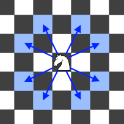

<h1 style='text-align: center;'> A. Immobile Knight</h1>

<h5 style='text-align: center;'>time limit per test: 2 seconds</h5>
<h5 style='text-align: center;'>memory limit per test: 256 megabytes</h5>

There is a chess board of size $n \times m$. The rows are numbered from $1$ to $n$, the columns are numbered from $1$ to $m$.

Let's call a cell isolated if a knight placed in that cell can't move to any other cell on the board. Recall that a chess knight moves two cells in one direction and one cell in a perpendicular direction: 

  Find any isolated cell on the board. If there are no such cells, print any cell on the board.

## Input

The first line contains a single integer $t$ ($1 \le t \le 64$) — the number of testcases.

The only line of each testcase contains two integers $n$ and $m$ ($1 \le n, m \le 8$) — the number of rows and columns of the board.

## Output

For each testcase, print two integers — the row and the column of any isolated cell on the board. If there are no such cells, print any cell on the board.

## Example

## Input


```

31 78 83 3
```
## Output


```

1 7
7 2
2 2

```
## Note

In the first testcase, all cells are isolated. A knight can't move from any cell of the board to any other one. Thus, any cell on board is a correct answer.

In the second testcase, there are no isolated cells. On a normal chess board, a knight has at least two moves from any cell. Thus, again, any cell is a correct answer.

In the third testcase, only the middle cell of the board is isolated. The knight can move freely around the border of the board, but can't escape the middle.


#### tags 

#800 #implementation 