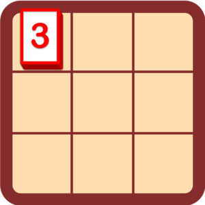

<h1 style='text-align: center;'> D. Knowledge Cards</h1>

<h5 style='text-align: center;'>time limit per test: 1 second</h5>
<h5 style='text-align: center;'>memory limit per test: 256 megabytes</h5>

Pak Chanek, a renowned scholar, invented a card puzzle using his knowledge. In the puzzle, you are given a board with $n$ rows and $m$ columns. Let $(r, c)$ represent the cell in the $r$-th row and the $c$-th column.

Initially, there are $k$ cards stacked in cell $(1, 1)$. Each card has an integer from $1$ to $k$ written on it. More specifically, the $i$-th card from the top of the stack in cell $(1, 1)$ has the number $a_i$ written on it. It is known that no two cards have the same number written on them. In other words, the numbers written on the cards are a permutation of integers from $1$ to $k$. All other cells are empty.

You need to move the $k$ cards to cell $(n, m)$ to create another stack of cards. Let $b_i$ be the number written on the $i$-th card from the top of the stack in cell $(n, m)$. You should create the stack in cell $(n, m)$ in such a way so that $b_i = i$ for all $1 \leq i \leq k$.

In one move, you can remove the top card from a cell and place it onto an adjacent cell (a cell that shares a common side). If the target cell already contains one or more cards, you place your card on the top of the stack. You must do each operation while satisfying the following restrictions: 

* Each cell other than $(1,1)$ and $(n,m)$ must not have more than one card on it.
* You cannot move a card onto cell $(1,1)$.
* You cannot move a card from cell $(n,m)$.

Given the values of $n$, $m$, $k$ and the array $a$, determine if the puzzle is solvable.

## Input

Each test contains multiple test cases. The first line contains an integer $t$ ($1 \leq t \leq 2 \cdot 10^4$) — the number of test cases. The following lines contain the description of each test case.

The first line of each test case contains three integers $n$, $m$, and $k$ ($3 \leq n, m \leq 10^6$, $nm \leq 10^6$, $1 \leq k \leq 10^5$) — the size of the board and the number of cards.

The second line of the test case contains $k$ integers $a_1, a_2, \ldots, a_k$ — the array $a$, representing the numbers written on the cards. The values of $a$ are a permutation of integers from $1$ to $k$.

It is guaranteed that the sum of $nm$ and $k$ over all test cases do not exceed $10^6$ and $10^5$ respectively.

## Output

For each test case, output "YA" (without quotes) if it is possible and "TIDAK" (without quotes) otherwise, which mean yes and no in Indonesian respectively.

You can output "YA" and "TIDAK" in any case (for example, strings "tiDAk", "tidak", and "Tidak" will be recognised as a negative response).

## Example

## Input


```

43 3 63 6 4 1 2 53 3 101 2 3 4 5 6 7 8 9 105 4 42 1 3 43 4 1010 4 9 3 5 6 8 2 7 1
```
## Output


```

YA
TIDAK
YA
YA

```
## Note

In the first test case, the following is one way the puzzle can be done: 

* Move the card with $3$ written on it from cell $(1, 1)$ to cell $(1, 2)$, then cell $(1, 3)$.
* Move the card with $6$ written on it from cell $(1, 1)$ to cell $(2, 1)$, then cell $(3, 1)$, then cell $(3, 2)$, then cell $(3, 3)$.
* Move the card with $4$ written on it from cell $(1, 1)$ to cell $(1, 2)$.
* Move the card with $1$ written on it from cell $(1, 1)$ to cell $(2, 1)$, then cell $(2, 2)$, then cell $(2, 3)$.
* Move the card with $2$ written on it from cell $(1, 1)$ to cell $(2, 1)$, then cell $(2, 2)$.
* Move the card with $5$ written on it from cell $(1, 1)$ to cell $(2, 1)$, then cell $(3, 1)$, then cell $(3, 2)$, then cell $(3, 3)$.
* Move the card with $2$ written on it from cell $(2, 2)$ to cell $(2, 1)$.
* Move the card with $4$ written on it from cell $(1, 2)$ to cell $(2, 2)$, then cell $(3, 2)$, then cell $(3, 3)$.
* Move the card with $3$ written on it from cell $(1, 3)$ to cell $(1, 2)$, then cell $(2, 2)$, then cell $(3, 2)$, then cell $(3, 3)$.
* Move the card with $2$ written on it from cell $(2, 1)$ to cell $(3, 1)$, then cell $(3, 2)$, then cell $(3, 3)$.
* Move the card with $1$ written on it from cell $(2, 3)$ to cell $(3, 3)$.

An animated illustration regarding the process mentioned above is as follows: 


#### tags 

#1500 #constructive_algorithms #data_structures 