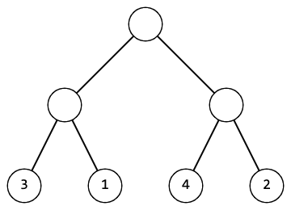
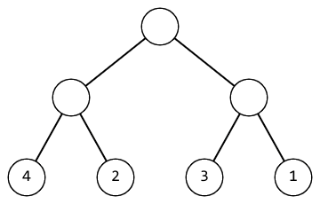

<h1 style='text-align: center;'> D. Masha and a Beautiful Tree</h1>

<h5 style='text-align: center;'>time limit per test: 2 seconds</h5>
<h5 style='text-align: center;'>memory limit per test: 256 megabytes</h5>

The girl named Masha was walking in the forest and found a complete binary tree of height $n$ and a permutation $p$ of length $m=2^n$.

A complete binary tree of height $n$ is a rooted tree such that every vertex except the leaves has exactly two sons, and the length of the path from the root to any of the leaves is $n$. The picture below shows the complete binary tree for $n=2$.

A permutation is an array consisting of $n$ different integers from $1$ to $n$. For example, [$2,3,1,5,4$] is a permutation, but [$1,2,2$] is not ($2$ occurs twice), and [$1,3,4$] is also not a permutation ($n=3$, but there is $4$ in the array).

Let's enumerate $m$ leaves of this tree from left to right. The leaf with the number $i$ contains the value $p_i$ ($1 \le i \le m$).

For example, if $n = 2$, $p = [3, 1, 4, 2]$, the tree will look like this:

  Masha considers a tree beautiful if the values in its leaves are ordered from left to right in increasing order.

In one operation, Masha can choose any non-leaf vertex of the tree and swap its left and right sons (along with their subtrees).

For example, if Masha applies this operation to the root of the tree discussed above, it will take the following form:

  Help Masha understand if she can make a tree beautiful in a certain number of operations. If she can, then output the minimum number of operations to make the tree beautiful.

## Input

The first line contains single integer $t$ ($1 \le t \le 10^4$) — number of test cases.

In each test case, the first line contains an integer $m$ ($1 \le m \le 262144$), which is a power of two  — the size of the permutation $p$.

The second line contains $m$ integers: $p_1, p_2, \dots, p_m$ ($1 \le p_i \le m$) — the permutation $p$.

It is guaranteed that the sum of $m$ over all test cases does not exceed $3 \cdot 10^5$.

## Output

For each test case in a separate line, print the minimum possible number of operations for which Masha will be able to make the tree beautiful or -1, if this is not possible.

## Example

## Input


```

486 5 7 8 4 3 1 243 1 4 21187 8 4 3 1 2 6 5
```
## Output


```

4
-1
0
-1

```
## Note

Consider the first test.

In the first test case, you can act like this (the vertex to which the operation is applied at the current step is highlighted in purple): 

 

|  |  |
| --- | --- |
|  |  |

  It can be shown that it is impossible to make a tree beautiful in fewer operations.In the second test case, it can be shown that it is impossible to make a tree beautiful.

In the third test case, the tree is already beautiful.


#### tags 

#1300 #dfs_and_similar #divide_and_conquer #graphs #sortings #trees 