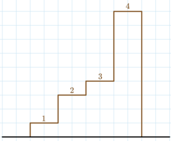

<h1 style='text-align: center;'> E. Scuza</h1>

<h5 style='text-align: center;'>time limit per test: 3 seconds</h5>
<h5 style='text-align: center;'>memory limit per test: 256 megabytes</h5>

Timur has a stairway with $n$ steps. The $i$-th step is $a_i$ meters higher than its predecessor. The first step is $a_1$ meters higher than the ground, and the ground starts at $0$ meters. 

  The stairs for the first test case. Timur has $q$ questions, each denoted by an integer $k_1, \dots, k_q$. For each question $k_i$, you have to print the maximum possible height Timur can achieve by climbing the steps if his legs are of length $k_i$. Timur can only climb the $j$-th step if his legs are of length at least $a_j$. In other words, $k_i \geq a_j$ for each step $j$ climbed.

## Note

 that you should answer each question independently.

## Input

The first line contains a single integer $t$ ($1 \leq t \leq 100$) — the number of test cases.

The first line of each test case contains two integers $n, q$ ($1 \leq n, q \leq 2\cdot10^5$) — the number of steps and the number of questions, respectively.

The second line of each test case contains $n$ integers ($1 \leq a_i \leq 10^9$) — the height of the steps.

The third line of each test case contains $q$ integers ($0 \leq k_i \leq 10^9$) — the numbers for each question.

It is guaranteed that the sum of $n$ does not exceed $2\cdot10^5$, and the sum of $q$ does not exceed $2\cdot10^5$.

## Output

For each test case, output a single line containing $q$ integers, the answer for each question.

Please note, that the answer for some questions won't fit into 32-bit integer type, so you should use at least 64-bit integer type in your programming language (like long long for C++).

## Example

## Input


```

34 51 2 1 51 2 4 9 102 21 10 13 11000000000 1000000000 10000000001000000000
```
## Output


```

1 4 4 9 9 
0 2 
3000000000 

```
## Note

Consider the first test case, pictured in the statement. 

* If Timur's legs have length $1$, then he can only climb stair $1$, so the highest he can reach is $1$ meter.
* If Timur's legs have length $2$ or $4$, then he can only climb stairs $1$, $2$, and $3$, so the highest he can reach is $1+2+1=4$ meters.
* If Timur's legs have length $9$ or $10$, then he can climb the whole staircase, so the highest he can reach is $1+2+1+5=9$ meters.

 In the first question of the second test case, Timur has no legs, so he cannot go up even a single step. :(

#### tags 

#1200 #binary_search #greedy #math 