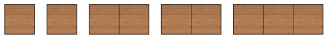
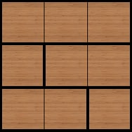

<h1 style='text-align: center;'> A. The Ultimate Square</h1>

<h5 style='text-align: center;'>time limit per test: 1 second</h5>
<h5 style='text-align: center;'>memory limit per test: 256 megabytes</h5>

You have $n$ rectangular wooden blocks, which are numbered from $1$ to $n$. The $i$-th block is $1$ unit high and $\lceil \frac{i}{2} \rceil$ units long.

Here, $\lceil \frac{x}{2} \rceil$ denotes the result of division of $x$ by $2$, rounded up. For example, $\lceil \frac{4}{2} \rceil = 2$ and $\lceil \frac{5}{2} \rceil = \lceil 2.5 \rceil = 3$.

For example, if $n=5$, then the blocks have the following sizes: $1 \times 1$, $1 \times 1$, $1 \times 2$, $1 \times 2$, $1 \times 3$.

  The available blocks for $n=5$ Find the maximum possible side length of a square you can create using these blocks, without rotating any of them. ## Note

 that you don't have to use all of the blocks.

  One of the ways to create $3 \times 3$ square using blocks $1$ through $5$ ## Input

Each test contains multiple test cases. The first line contains a single integer $t$ ($1 \le t \le 10^4$) — the number of test cases.

The first line of each test case contains a single integer $n$ ($1 \le n \le 10^9$) — the number of blocks.

## Output

For each test case, print one integer — the maximum possible side length of a square you can create.

## Example

## Input


```

325197654321
```
## Output


```

1
3
98827161

```
## Note

In the first test case, you can create a $1 \times 1$ square using only one of the blocks.

In the second test case, one of the possible ways to create a $3 \times 3$ square is shown in the statement. It is impossible to create a $4 \times 4$ or larger square, so the answer is $3$.


#### tags 

#800 #math 