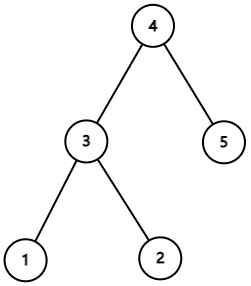

<h1 style='text-align: center;'> G. Centroid Guess</h1>

<h5 style='text-align: center;'>time limit per test: 4 seconds</h5>
<h5 style='text-align: center;'>memory limit per test: 512 megabytes</h5>

This in an interactive problem.

There is an unknown tree consisting of $n$ nodes, which has exactly one centroid. You only know $n$ at first, and your task is to find the centroid of the tree.

You can ask the distance between any two vertices for at most $2\cdot10^5$ times. 

## Note

 that the interactor is not adaptive. That is, the tree is fixed in each test beforehand and does not depend on your queries.

A vertex is called a centroid if its removal splits the tree into subtrees with at most $\lfloor\frac{n}{2}\rfloor$ vertices each.

## Input

The only line of the input contains an integer $n$ ($3\le n\le 7.5\cdot10^4$) — the number of nodes in the tree.

## Interaction

Start interaction by reading $n$.

To ask a query about the distance between two nodes $u, v$ ($1 \le u, v \le n$), output "? u v".

If you determine that the centroid of the tree is $x$, use "! x" to report.

After printing a query, do not forget to output the end of a line and flush the output. Otherwise, you will get Idleness limit exceeded. To do this, use:

* fflush(stdout) or cout.flush() in C++;
* System.out.flush() in Java;
* flush(output) in Pascal;
* stdout.flush() in Python;
* see documentation for other languages.

Hacks are disabled in this problem.

It's guaranteed that there are at most $500$ tests in this problem.

## Example

## Input


```

5

2

1

2

3

1

1

1

```
Output
```


? 1 2

? 1 3

? 1 4

? 1 5

? 2 3

? 3 4

? 4 5

! 3

```
## Note

Here is an image of the tree from the sample.

  

#### tags 

#3500 #interactive #probabilities #trees 