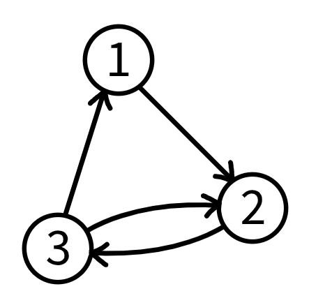

<h1 style='text-align: center;'> E. Node Pairs</h1>

<h5 style='text-align: center;'>time limit per test: 2 seconds</h5>
<h5 style='text-align: center;'>memory limit per test: 256 megabytes</h5>

Let's call an ordered pair of nodes $(u, v)$ in a directed graph unidirectional if $u \neq v$, there exists a path from $u$ to $v$, and there are no paths from $v$ to $u$.

A directed graph is called $p$-reachable if it contains exactly $p$ ordered pairs of nodes $(u, v)$ such that $u < v$ and $u$ and $v$ are reachable from each other. Find the minimum number of nodes required to create a $p$-reachable directed graph.

Also, among all such $p$-reachable directed graphs with the minimum number of nodes, let $G$ denote a graph which maximizes the number of unidirectional pairs of nodes. Find this number.

## Input

The first and only line contains a single integer $p$ ($0 \le p \le 2 \cdot 10^5$) — the number of ordered pairs of nodes.

## Output

Print a single line containing two integers — the minimum number of nodes required to create a $p$-reachable directed graph, and the maximum number of unidirectional pairs of nodes among all such $p$-reachable directed graphs with the minimum number of nodes.

## Examples

## Input


```

3

```
## Output


```

3 0

```
## Input


```

4

```
## Output


```

5 6

```
## Input


```

0

```
## Output


```

0 0

```
## Note

In the first test case, the minimum number of nodes required to create a $3$-reachable directed graph is $3$. Among all $3$-reachable directed graphs with $3$ nodes, the following graph $G$ is one of the graphs with the maximum number of unidirectional pairs of nodes, which is $0$. 

  

#### tags 

#2200 #dp #graphs #math #number_theory 