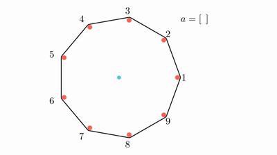

<h1 style='text-align: center;'> D. Doremy's Pegging Game</h1>

<h5 style='text-align: center;'>time limit per test: 1.5 seconds</h5>
<h5 style='text-align: center;'>memory limit per test: 512 megabytes</h5>

Doremy has $n+1$ pegs. There are $n$ red pegs arranged as vertices of a regular $n$-sided polygon, numbered from $1$ to $n$ in anti-clockwise order. There is also a blue peg of slightly smaller diameter in the middle of the polygon. A rubber band is stretched around the red pegs.

Doremy is very bored today and has decided to play a game. Initially, she has an empty array $a$. While the rubber band does not touch the blue peg, she will:

1. choose $i$ ($1 \leq i \leq n$) such that the red peg $i$ has not been removed;
2. remove the red peg $i$;
3. append $i$ to the back of $a$.

Doremy wonders how many possible different arrays $a$ can be produced by the following process. Since the answer can be big, you are only required to output it modulo $p$. $p$ is guaranteed to be a prime number.

  game with $n=9$ and $a=[7,5,2,8,3,9,4]$ and another game with $n=8$ and $a=[3,4,7,1,8,5,2]$ ## Input

The first line contains two integers $n$ and $p$ ($3 \leq n \leq 5000$, $10^8 \le p \le 10^9$) — the number of red pegs and the modulo respectively.

$p$ is guaranteed to be a prime number.

## Output

## Output

 a single integer, the number of different arrays $a$ that can be produced by the process described above modulo $p$.

## Examples

## Input


```

4 100000007

```
## Output


```

16

```
## Input


```

1145 141919831

```
## Output


```

105242108

```
## Note

In the first test case, $n=4$, some possible arrays $a$ that can be produced are $[4,2,3]$ and $[1,4]$. However, it is not possible for $a$ to be $[1]$ or $[1,4,3]$.


#### tags 

#2000 #combinatorics #dp #math 