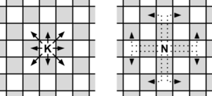
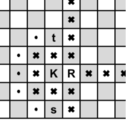

<h1 style='text-align: center;'> I. Infinite Chess</h1>

<h5 style='text-align: center;'>time limit per test: 3 seconds</h5>
<h5 style='text-align: center;'>memory limit per test: 512 megabytes</h5>

The black king lives on a chess board with an infinite number of columns (files) and $8$ rows (ranks). The columns are numbered with all integer numbers (including negative). The rows are numbered from $1$ to $8$.

Initially, the black king is located on the starting square $(x_s, y_s)$, and he needs to reach some target square $(x_t, y_t)$. Unfortunately, there are also white pieces on the board, and they threaten the black king. After negotiations, the white pieces agreed to let the black king pass to the target square on the following conditions:

* each turn, the black king makes a move according to the movement rules;
* the black king cannot move to a square occupied by a white piece;
* the black king cannot move to a square which is under attack by any white piece. A square is under attack if a white piece can reach it in one move according to the movement rules;
* the white pieces never move.

Help the black king find the minimum number of moves needed to reach the target square while not violating the conditions. The black king cannot leave the board at any time.

The black king moves according to the movement rules below. Even though the white pieces never move, squares which they can reach in one move are considered to be under attack, so the black king cannot move into those squares.

Below are the movement rules. ## Note

 that the pieces (except for the knight) cannot jump over other pieces.

* a king moves exactly one square horizontally, vertically, or diagonally.
* a rook moves any number of vacant squares horizontally or vertically.
* a bishop moves any number of vacant squares diagonally.
* a queen moves any number of vacant squares horizontally, vertically, or diagonally.
* a knight moves to one of the nearest squares not on the same rank, file, or diagonal (this can be thought of as moving two squares horizontally then one square vertically, or moving one square horizontally then two squares vertically — i. e. in an "L" pattern). Knights are not blocked by other pieces, they can simply jump over them.

There are no pawns on the board.

   King and knight possible moves, respectively. Dotted line shows that knight can jump over other pieces.    Queen, bishop, and rook possible moves, respectively. ## Input

The first line contains two integers $x_s$ and $y_s$ ($1 \le x_s \le 10^8$; $1 \le y_s \le 8$) — the starting coordinates of the black king.

The second line contains two integers $x_t$ and $y_t$ ($1 \le x_t \le 10^8$; $1 \le y_t \le 8$) — the coordinates of the target square for the black king.

The third line contains one integer $n$ ($0 \le n \le 2000$) — the number of white pieces on the board.

Then $n$ lines follow, the $i$-th line contains one character $t_i$ and two integers $x_i$ and $y_i$ ($1 \le x_i \le 10^8$; $1 \le y_i \le 8$) — the type and the coordinates of the $i$-th white piece. The types of pieces are represented by the following uppercase Latin letters:

* K — king
* Q — queen
* R — rook
* B — bishop
* N — knight

There can be any number of white pieces of any type listed above on the board, for example, $3$ white kings or $4$ white queens. There are no pawns on the board.

Additional constrains on the input:

* no square is occupied by more than one white piece;
* the starting square for the black king is different from the square he wants to reach, and neither of these two squares is occupied or is under attack by any white piece.
## Output

Print one integer — the minimum number of moves needed for the black king to reach the target square while not violating the conditions, or $-1$ if it is impossible.

## Examples

## Input


```

1 8
7 8
2
N 4 8
B 4 6

```
## Output


```

10

```
## Input


```

1 1
1 5
2
K 1 3
R 2 3

```
## Output


```

6

```
## Input


```

2 2
6 4
1
Q 4 3

```
## Output


```

-1

```
## Note

The image below demonstrates the solution for the second example. Here, the letters K, R, s, and t represent the white king, the white rook, the starting square, and the target square, respectively. Bold crosses mark the squares which are under attack by the white pieces. Bold dots show the shortest path for the black king.

  

#### tags 

#2800 #implementation #shortest_paths 