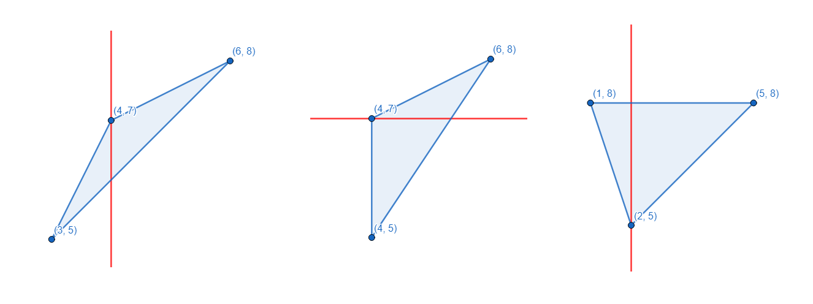
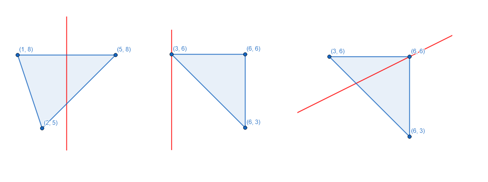

<h1 style='text-align: center;'> A. Cut the Triangle</h1>

<h5 style='text-align: center;'>time limit per test: 2 seconds</h5>
<h5 style='text-align: center;'>memory limit per test: 512 megabytes</h5>

You are given a non-degenerate triangle (a non-degenerate triangle is a triangle with positive area). The vertices of the triangle have coordinates $(x_1, y_1)$, $(x_2, y_2)$ and $(x_3, y_3)$.

You want to draw a straight line to cut the triangle into two non-degenerate triangles. Furthermore, the line you draw should be either horizontal or vertical.

Can you draw the line to meet all the constraints?

Here are some suitable ways to draw the line:

  However, these ways to draw the line are not suitable (the first line cuts the triangle into a triangle and a quadrangle; the second line doesn't cut the triangle at all; the third line is neither horizontal nor vertical):

  ## Input

The first line contains one integer $t$ ($1 \le t \le 10^4$) — the number of test cases.

Each test case consists of four lines. The first of them is empty. The $i$-th of the next three lines contains two integers $x_i$ and $y_i$ ($1 \le x_i, y_i \le 10^8$) — the coordinates of the $i$-th vertex of the triangle.

Additional constraint on the input: in each test case, the triangle formed by three vertices has positive area (i. e. it is non-degenerate).

## Output

For each test case, print YES if it is possible to cut the triangle according to the statement, or NO otherwise. You may print each letter in any case (YES, yes, Yes will all be recognized as positive answer, NO, no and nO will all be recognized as negative answer).

## Example

## Input


```

4  
4 76 83 5  
4 54 76 8  
5 81 82 5  
3 66 66 3
```
## Output


```

YES
YES
YES
NO

```


#### tags 

#800 #implementation 