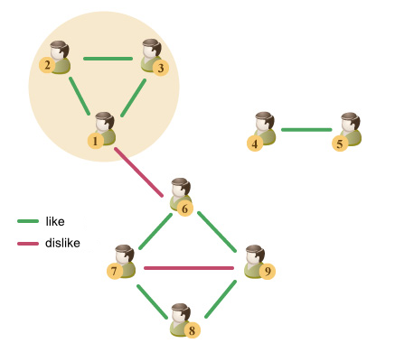

<h1 style='text-align: center;'> C2. Party</h1>

<h5 style='text-align: center;'>time limit per test: 2 seconds</h5>
<h5 style='text-align: center;'>memory limit per test: 256 megabytes</h5>

To celebrate the second ABBYY Cup tournament, the Smart Beaver decided to throw a party. The Beaver has a lot of acquaintances, some of them are friends with each other, and some of them dislike each other. To make party successful, the Smart Beaver wants to invite only those of his friends who are connected by friendship relations, and not to invite those who dislike each other. Both friendship and dislike are mutual feelings.

More formally, for each invited person the following conditions should be fulfilled: 

* all his friends should also be invited to the party;
* the party shouldn't have any people he dislikes;
* all people who are invited to the party should be connected with him by friendship either directly or through a chain of common friends of arbitrary length. We'll say that people *a*1 and *a**p* are connected through a chain of common friends if there exists a sequence of people *a*2, *a*3, ..., *a**p* - 1 such that all pairs of people *a**i* and *a**i* + 1 (1 ≤ *i* < *p*) are friends.

Help the Beaver find the maximum number of acquaintances he can invite.

## Input

The first line of input contains an integer *n* — the number of the Beaver's acquaintances. 

The second line contains an integer *k*  — the number of pairs of friends. Next *k* lines contain space-separated pairs of integers *u**i*, *v**i*  — indices of people who form the *i*-th pair of friends.

The next line contains an integer *m*  — the number of pairs of people who dislike each other. Next *m* lines describe pairs of people who dislike each other in the same format as the pairs of friends were described.

Each pair of people is mentioned in the input at most once . In particular, two persons cannot be friends and dislike each other at the same time.

The input limitations for getting 30 points are: 

* 2 ≤ *n* ≤ 14

 The input limitations for getting 100 points are: 

* 2 ≤ *n* ≤ 2000

 ## Output

## Output

 a single number — the maximum number of people that can be invited to the party. If a group of people that meets all the requirements is impossible to select, output 0.

## Examples

## Input


```
9  
8  
1 2  
1 3  
2 3  
4 5  
6 7  
7 8  
8 9  
9 6  
2  
1 6  
7 9  

```
## Output


```
3
```
## Note

Let's have a look at the example. 

  Two groups of people can be invited: {1, 2, 3} and {4, 5}, thus the answer will be the size of the largest of these groups. Group {6, 7, 8, 9} doesn't fit, since it includes people 7 and 9 who dislike each other. Group {1, 2, 3, 4, 5} also doesn't fit, because not all of its members are connected by a chain of common friends (for example, people 2 and 5 aren't connected).


#### tags 

#1500 #brute_force #dfs_and_similar #dsu #graphs 