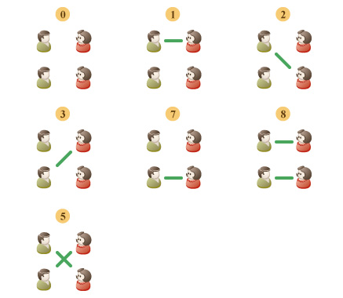

<h1 style='text-align: center;'> F1. Script Generation</h1>

<h5 style='text-align: center;'>time limit per test: 2 seconds</h5>
<h5 style='text-align: center;'>memory limit per test: 256 megabytes</h5>

The Smart Beaver from ABBYY was offered a job of a screenwriter for the ongoing TV series. In particular, he needs to automate the hard decision: which main characters will get married by the end of the series.

There are *n* single men and *n* single women among the main characters. An opinion poll showed that viewers like several couples, and a marriage of any of them will make the audience happy. The Smart Beaver formalized this fact as *k* triples of numbers (*h*, *w*, *r*), where *h* is the index of the man, *w* is the index of the woman, and *r* is the measure of the audience's delight in case of the marriage of this couple. The same poll showed that the marriage of any other couple will leave the audience indifferent, so the screenwriters decided not to include any such marriages in the plot.

The script allows you to arrange several marriages between the heroes or not to arrange marriages at all. A subset of some of the *k* marriages is considered acceptable if each man and each woman is involved in at most one marriage of the subset (the series won't allow any divorces). The value of the acceptable set of marriages is the total delight the spectators will get from the marriages included in this set.

Obviously, there is a finite number of acceptable sets, and they all describe some variants of the script. The screenwriters do not want to choose a set with maximum value — it would make the plot too predictable. So the Smart Beaver offers the following option: sort all the acceptable sets in increasing order of value and choose the *t*-th set from the sorted list. Thus, *t* = 1 corresponds to a plot without marriages, *t* = 2 — to a single marriage resulting in minimal delight for the audience, and so on.

Help the Beaver to implement the algorithm for selecting the desired set.

## Input

The first input line contains integers *n*, *k* and *t* (1 ≤ *k* ≤ *min*(100, *n*2), 1 ≤ *t* ≤ 2·105), separated by single spaces. Next *k* lines contain triples of integers (*h*, *w*, *r*) (1 ≤ *h*, *w* ≤ *n*; 1 ≤ *r* ≤ 1000), separated by single spaces, which describe the possible marriages. It is guaranteed that the input data is correct: *t* doesn't exceed the total number of acceptable sets, and each pair (*h*, *w*) is present in at most one triple.

The input limitations for getting 30 points are: 

* 1 ≤ *n* ≤ 5

 The input limitations for getting 100 points are: 

* 1 ≤ *n* ≤ 20

 ## Output

Print a single number — the value of the *t*-th acceptable variant.

## Examples

## Input


```
2 4 3  
1 1 1  
1 2 2  
2 1 3  
2 2 7  

```
## Output


```
2  

```
## Input


```
2 4 7  
1 1 1  
1 2 2  
2 1 3  
2 2 7  

```
## Output


```
8  

```
## Note

The figure shows 7 acceptable sets of marriages that exist in the first sample. 

  

#### tags 

#1800 