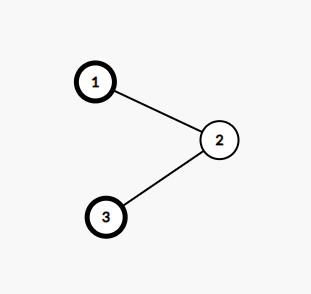
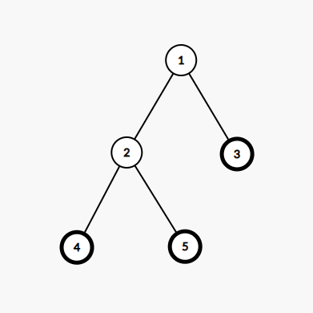

<h1 style='text-align: center;'> E. Koxia and Tree</h1>

<h5 style='text-align: center;'>time limit per test: 3 seconds</h5>
<h5 style='text-align: center;'>memory limit per test: 256 megabytes</h5>

Imi has an undirected tree with $n$ vertices where edges are numbered from $1$ to $n-1$. The $i$-th edge connects vertices $u_i$ and $v_i$. There are also $k$ butterflies on the tree. Initially, the $i$-th butterfly is on vertex $a_i$. All values of $a$ are pairwise distinct.

Koxia plays a game as follows:

* For $i = 1, 2, \dots, n - 1$, Koxia set the direction of the $i$-th edge as $u_i \rightarrow v_i$ or $v_i \rightarrow u_i$ with equal probability.
* For $i = 1, 2, \dots, n - 1$, if a butterfly is on the initial vertex of $i$-th edge and there is no butterfly on the terminal vertex, then this butterfly flies to the terminal vertex. ## Note

 that operations are sequentially in order of $1, 2, \dots, n - 1$ instead of simultaneously.
* Koxia chooses two butterflies from the $k$ butterflies with equal probability from all possible $\frac{k(k-1)}{2}$ ways to select two butterflies, then she takes the distance$^\dagger$ between the two chosen vertices as her score.

Now, Koxia wants you to find the expected value of her score, modulo $998\,244\,353^\ddagger$.

$^\dagger$ The distance between two vertices on a tree is the number of edges on the (unique) simple path between them.

$^\ddagger$ Formally, let $M = 998\,244\,353$. It can be shown that the answer can be expressed as an irreducible fraction $\frac{p}{q}$, where $p$ and $q$ are integers and $q \not \equiv 0 \pmod{M}$. ## Output

 the integer equal to $p \cdot q^{-1} \bmod M$. In other words, output such an integer $x$ that $0 \le x < M$ and $x \cdot q \equiv p \pmod{M}$.

## Input

The first line contains two integers $n$, $k$ ($2 \leq k \leq n \leq 3 \cdot {10}^5$) — the size of the tree and the number of butterflies.

The second line contains $k$ integers $a_1, a_2, \dots, a_k$ ($1 \leq a_i \leq n$) — the initial position of butterflies. It's guaranteed that all positions are distinct.

The $i$-th line in following $n − 1$ lines contains two integers $u_i$, $v_i$ ($1 \leq u_i, v_i \leq n$, $u_i \neq v_i$) — the vertices the $i$-th edge connects.

It is guaranteed that the given edges form a tree.

## Output

## Output

 a single integer — the expected value of Koxia's score, modulo $998\,244\,353$.

## Examples

## Input


```

3 2
1 3
1 2
2 3

```
## Output


```

748683266
```
## Input


```

5 3
3 4 5
1 2
1 3
2 4
2 5

```
## Output


```

831870296
```
## Note

In the first test case, the tree is shown below. Vertices containing butterflies are noted as bold.

  There are only $2$ butterflies so the choice of butterflies is fixed. Let's consider the following $4$ cases:

* Edges are $1 \rightarrow 2$ and $2 \rightarrow 3$: butterfly on vertex $1$ moves to vertex $2$, but butterfly on vertex $3$ doesn't move. The distance between vertices $2$ and $3$ is $1$.
* Edges are $1 \rightarrow 2$ and $3 \rightarrow 2$: butterfly on vertex $1$ moves to vertex $2$, but butterfly on vertex $3$ can't move to vertex $2$ because it's occupied. The distance between vertices $2$ and $3$ is $1$.
* Edges are $2 \rightarrow 1$ and $2 \rightarrow 3$: butterflies on both vertex $1$ and vertex $3$ don't move. The distance between vertices $1$ and $3$ is $2$.
* Edges are $2 \rightarrow 1$ and $3 \rightarrow 2$: butterfly on vertex $1$ doesn't move, but butterfly on vertex $3$ move to vertex $2$. The distance between vertices $1$ and $2$ is $1$.

Therefore, the expected value of Koxia's score is $\frac {1+1+2+1} {4} = \frac {5} {4}$, which is $748\,683\,266$ after modulo $998\,244\,353$.

In the second test case, the tree is shown below. Vertices containing butterflies are noted as bold. The expected value of Koxia's score is $\frac {11} {6}$, which is $831\,870\,296$ after modulo $998\,244\,353$.

  

#### tags 

#2400 #combinatorics #dfs_and_similar #dp #dsu #math #probabilities #trees 