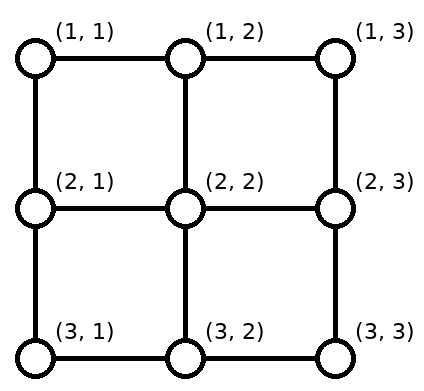
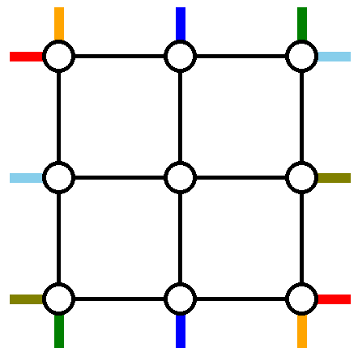
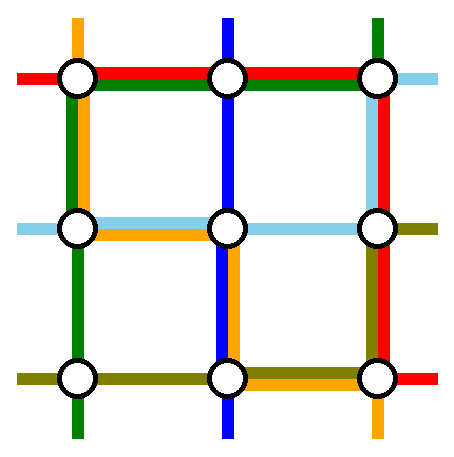
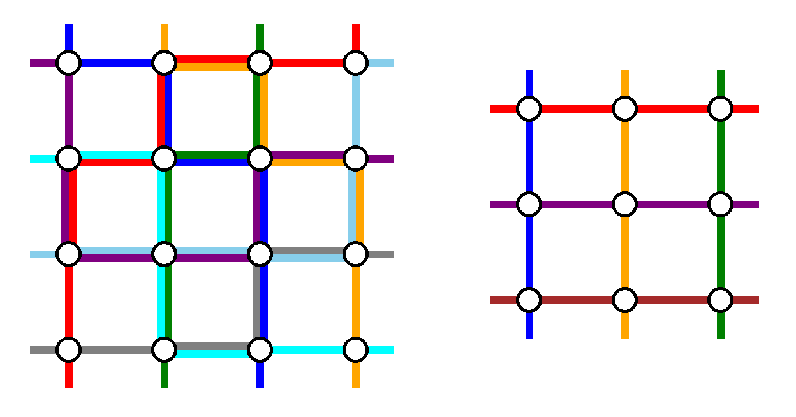

<h1 style='text-align: center;'> H. Koxia, Mahiru and Winter Festival</h1>

<h5 style='text-align: center;'>time limit per test: 2 seconds</h5>
<h5 style='text-align: center;'>memory limit per test: 256 megabytes</h5>

Wow, what a big face!Kagura MahiruKoxia and Mahiru are enjoying the Winter Festival. The streets of the Winter Festival can be represented as a $n \times n$ undirected grid graph. Formally, the set of vertices is $\{(i,j) \; | \; 1 \leq i,j\leq n \}$ and two vertices $(i_1,j_1)$ and $(i_2,j_2)$ are connected by an edge if and only if $|i_1-i_2|+|j_1-j_2|=1$.

  A network with size $n = 3$. Koxia and Mahiru are planning to visit The Winter Festival by traversing $2n$ routes. Although routes are not planned yet, the endpoints of the routes are already planned as follows:

* In the $i$-th route, they want to start from vertex $(1, i)$ and end at vertex $(n, p_i)$, where $p$ is a permutation of length $n$.
* In the $(i+n)$-th route, they want to start from vertex $(i, 1)$ and end at vertex $(q_i, n)$, where $q$ is a permutation of length $n$.

  A network with size $n = 3$, points to be connected are shown in the same color for $p = [3, 2, 1]$ and $q = [3, 1, 2]$. Your task is to find a routing scheme — $2n$ paths where each path connects the specified endpoints. Let's define the congestion of an edge as the number of times it is used (both directions combined) in the routing scheme. In order to ensure that Koxia and Mahiru won't get too bored because of traversing repeated edges, please find a routing scheme that minimizes the maximum congestion among all edges.

  An example solution — the maximum congestion is $2$, which is optimal in this case. ## Input

The first line contains an integer $n$ ($2 \leq n \leq 200$) — the size of the network. 

The second line contains $n$ integers $p_1, p_2, \dots, p_n$ ($1 \leq p_i \leq n$).

The third line contains $n$ integers $q_1, q_2, \dots, q_n$ ($1 \leq q_i \leq n$).

It is guaranteed that both $p$ and $q$ are permutations of length $n$.

## Output

## Output

 $2n$ lines, each line describing a route.

The first $n$ lines should describe the connections from top to bottom. The $i$-th line should describe the route starting at vertex $(1, i)$ and ending at vertex $(n, p_i)$.

The next $n$ lines should describe the connections from left to right. The $(i+n)$-th line should describe the route starting at vertex $(i, 1)$ and ending at vertex $(q_i, n)$.

Each line describing a route should start with an integer $k$ ($2 \le k \le 10^5$) — the number of vertices the route passes, including the starting and ending vertices. Then output all the vertices on the route in order. In other words, if the route is $(x_1, y_1) \rightarrow (x_2, y_2) \rightarrow \dots \rightarrow (x_k, y_k)$, then output $k~x_1~y_1~x_2~y_2 \ldots x_k~y_k$. ## Note

 that $|x_i-x_{i+1}|+|y_i-y_{i+1}| = 1$ should holds for $1 \le i < k$.

If there are multiple solutions that minimize the maximum congestion, you may output any.

## Examples

## Input


```

3
3 2 1
3 1 2

```
## Output


```

5 1 1 2 1 2 2 3 2 3 3 
3 1 2 2 2 3 2 
5 1 3 1 2 1 1 2 1 3 1 
5 1 1 1 2 1 3 2 3 3 3
4 2 1 2 2 2 3 1 3 
4 3 1 3 2 3 3 2 3

```
## Input


```

4
3 4 2 1
2 4 1 3

```
## Output


```

6 1 1 1 2 2 2 2 3 3 3 4 3
6 1 2 1 3 2 3 2 4 3 4 4 4
5 1 3 2 3 2 2 3 2 4 2
7 1 4 1 3 1 2 2 2 2 1 3 1 4 1
7 1 1 2 1 3 1 3 2 3 3 2 3 2 4
6 2 1 2 2 3 2 4 2 4 3 4 4
6 3 1 3 2 3 3 3 4 2 4 1 4
5 4 1 4 2 4 3 3 3 3 4

```
## Input


```

3
1 2 3
1 2 3

```
## Output


```

3 1 1 2 1 3 1 
3 1 2 2 2 3 2 
3 1 3 2 3 3 3 
3 1 1 1 2 1 3 
3 2 1 2 2 2 3 
3 3 1 3 2 3 3 

```
## Note

The first example corresponds to the figures in the problem statement.

The output for examples $2$ and $3$ respectively are visualized below:

  Sample output for examples $2$ and $3$. Maximum congestions are $2$ and $1$ respectively. 

#### tags 

#3500 #constructive_algorithms 