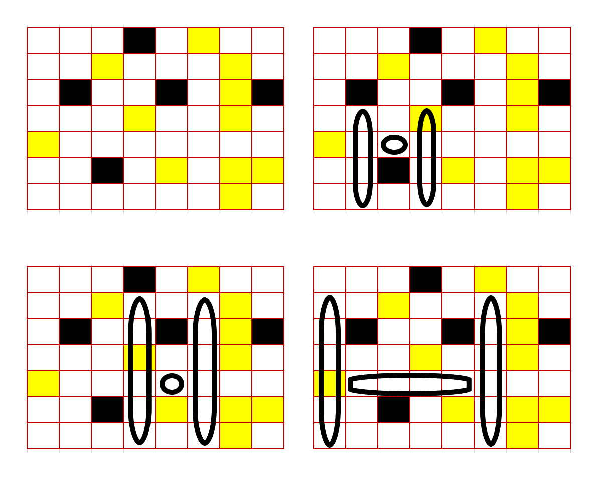

<h1 style='text-align: center;'> E. Hossam and a Letter</h1>

<h5 style='text-align: center;'>time limit per test: 2 seconds</h5>
<h5 style='text-align: center;'>memory limit per test: 256 megabytes</h5>

Hossam bought a new piece of ground with length $n$ and width $m$, he divided it into an $n \cdot m$ grid, each cell being of size $1\times1$.

Since Hossam's name starts with the letter 'H', he decided to draw the capital letter 'H' by building walls of size $1\times1$ on some squares of the ground. Each square $1\times1$ on the ground is assigned a quality degree: perfect, medium, or bad.

The process of building walls to form up letter 'H' has the following constraints:

* The letter must consist of one horizontal and two vertical lines.
* The vertical lines must not be in the same or neighboring columns.
* The vertical lines must start in the same row and end in the same row (and thus have the same length).
* The horizontal line should connect the vertical lines, but must not cross them.
* The horizontal line can be in any row between the vertical lines (not only in the middle), except the top and the bottom one. (With the horizontal line in the top row the letter looks like 'n', and in the bottom row like 'U'.)
* It is forbidden to build walls in cells of bad quality.
* You can use at most one square of medium quality.
* You can use any number of squares of perfect quality.

Find the maximum number of walls that can be used to draw the letter 'H'.

Check the note for more clarification.

## Input

The first line of the input contains two integer numbers $n$, $m$ ($1 \le n, m \le 400$).

The next $n$ lines of the input contain $m$ characters each, describing the grid. The character '.' stands for a perfect square, the character 'm' stands for a medium square, and the character '#' stands for a bad square.

## Output

Print a single integer — the maximum number of walls that form a capital letter 'H'.

If it is not possible to draw any letter 'H', print $0$.

## Examples

## Input


```

2 3
#m.
.#.

```
## Output


```

0

```
## Input


```

7 8
...#.m..
..m...m.
.#..#.m#
...m..m.
m.......
..#.m.mm
......m.

```
## Output


```

16

```
## Note

In the first test case, we can't build the letter 'H'.

For the second test case, the figure below represents the grid and some of the valid letters 'H'. Perfect, medium, and bad squares are represented with white, yellow, and black colors respectively.

  

#### tags 

#2500 #brute_force #dp #implementation #two_pointers 