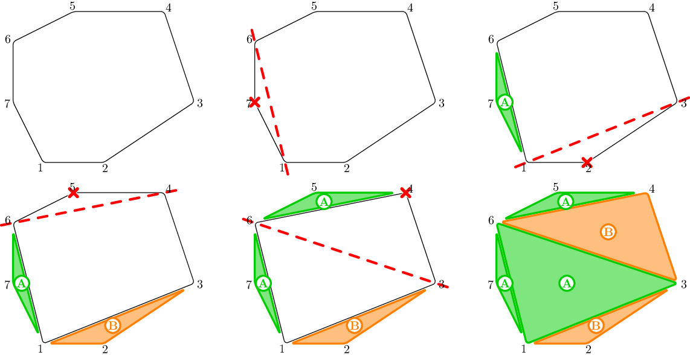

<h1 style='text-align: center;'> I. Spinach Pizza</h1>

<h5 style='text-align: center;'>time limit per test: 2 seconds</h5>
<h5 style='text-align: center;'>memory limit per test: 256 megabytes</h5>

The two siblings Alberto and Beatrice have to eat a spinach pizza together. However, none of them likes spinach, so they both want to eat as little as possible.

The pizza has the shape of a strictly convex polygon with $n$ vertices located at integer coordinates $(x_1, y_1), \, (x_2, y_2), \, \dots, \, (x_n, y_n)$ of the plane.

The siblings have decided to eat the pizza in the following way: taking turns, starting with Alberto, each sibling chooses a vertex of the remaining part of the pizza and eats out the triangle determined by its two neighboring edges. In this way, after each of the first $n - 3$ turns the pizza will have one less vertex. The game ends after the $(n - 2)$-th turn, when all the pizza has been eaten.

Assuming that Alberto and Beatrice choose the slices to eat optimally, which of the siblings manages to eat at most half of the pizza? You should identify a sibling that has a strategy to do so and help them choose the slices appropriately. ## Note

 that it is possible that both Alberto and Beatrice end up eating exactly half of the area if they choose their slices optimally.

## Input

The first line contains a single integer $n$ ($4 \le n \le 100$) — the number of vertices.

The next $n$ lines contain two integers $x_i$ and $y_i$ each ($-10^6 \le x_i, y_i \le 10^6$) — the coordinates of the $i$-th vertex of the polygon representing the initial shape of the pizza.

It is guaranteed that the polygon is strictly convex and that its vertices are given in counterclockwise order.

## Interaction

First, you should print a line containing either the string $\texttt{Alberto}$ or the string $\texttt{Beatrice}$ — the sibling that you will help to win.

Then, for the next $n - 2$ turns, you will alternate with the judge in choosing a slice of the pizza and removing it, starting with you if you chose to help Alberto, or starting with the judge if you chose to help Beatrice.

* When it is your turn, print a single line containing an integer $p$ ($1 \leq p \leq n$) that has not been chosen before, indicating that you want to eat the slice determined by the vertex located at $(x_p, y_p)$.
* When it is the judge's turn, read an integer $q$ ($1 \leq q \leq n$), indicating that the other player eats the slice determined by the vertex located at $(x_q, y_q)$. It is guaranteed that $q$ has not been chosen before.

If one of your interactions is malformed, the interactor terminates immediately and your program receives the verdict $\texttt{WRONG-ANSWER}$. Otherwise, you will receive $\texttt{CORRECT}$ if at the end your player has eaten at most half of the pizza, and $\texttt{WRONG-ANSWER}$ otherwise.

After printing a line do not forget to end the line and flush the output. Otherwise, you will get the verdict $\texttt{TIMELIMIT}$. To flush the output, use:

* $\texttt{fflush(stdout)}$ in C;
* $\texttt{fflush(stdout)}$, $\texttt{cout <}\texttt{< flush}$ or $\texttt{cout.flush()}$ in C++;
* $\texttt{System.out.flush()}$ in Java and Kotlin;
* $\texttt{sys.stdout.flush()}$ in Python.
## Examples

## Input


```

4
0 0
6 1
5 3
1 4

```
Output
```

-
```
## Input


```

6
0 0
2 0
3 2
2 4
0 4
-1 2

```
Output
```

-
```
## Input


```

7
0 0
2 0
5 2
4 5
1 5
-1 4
-1 2

```
Output
```

-
```
## Note

In the first sample, the pizza has area $15$. Alberto can eat less than half of the pizza by eating the slice around vertex $2$ (which has area $6.5$) or around vertex $3$ (which has area $3.5$).

  In the second sample, it can be proved that both players will eat exactly half of the pizza if they eat optimally. Therefore it is possible to choose to help either Alberto or Beatrice.

In the third sample, it is possible to show that only Beatrice has a strategy to eat at most half of the pizza. The following is an example of a valid interaction (after reading the input):

$$ \begin{array}{|c|c|c|} \hline \textbf{Contestant} & \textbf{Judge} & \textbf{Explanation} \\\ \hline \texttt{Beatrice} & & \text{The contestant will help Beatrice} \\\ \hline & \texttt{7} & \text{Alberto eats the triangle with vertices $6$, $7$, $1$ and area $1$} \\\ \hline \texttt{2} & & \text{Beatrice eats the triangle with vertices $1$, $2$, $3$ and area $2$} \\\ \hline & \texttt{5} & \text{Alberto eats the triangle with vertices $4$, $5$, $6$ and area $1.5$} \\\ \hline \texttt{4} & & \text{Beatrice eats the triangle with vertices $3$, $4$, $6$ and area $8$} \\\ \hline & \texttt{6} & \text{Alberto eats the triangle with vertices $3$, $6$, $1$ and area $11$} \\\ \hline \end{array} $$ The total area eaten by Alberto is $13.5$ and the total area eaten by Beatrice is $10$, which is less than half the area of the whole pizza. The actions performed by the contestant and the judge in this example of interaction may be non-optimal. The process is illustrated below:

  

#### tags 

#2500 #games #geometry #greedy #interactive 