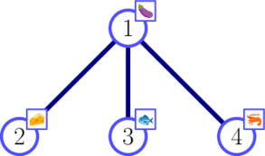

<h1 style='text-align: center;'> M. Parmigiana With Seafood</h1>

<h5 style='text-align: center;'>time limit per test: 2 seconds</h5>
<h5 style='text-align: center;'>memory limit per test: 256 megabytes</h5>

The "Parmigiana di melanzane" is a typical Italian dish. Alessandro and Bianca have very different tastes when it comes to it: Alessandro loves to eat Parmigiana with seafood, but Bianca thinks it is an atrocity! To decide which ingredients to include in the dish they prepare, they play the following game.

There are $n$ possible ingredients, labeled from $1$ to $n$. The higher the label, the closer the ingredient is to being seafood. The ingredients are connected by $n - 1$ edges, in such a way as to form a tree. Alessandro and Bianca take turns, with Alessandro going first. They alternately choose a terminal ingredient $x$, that is an ingredient currently connected to at most one other ingredient, and remove it from the tree. If the terminal ingredient $x$ was chosen by Alessandro, it goes in the recipe; if it was chosen by Bianca, it is discarded.

The taste of the Parmigiana is measured as the maximum label of an ingredient in the recipe. Alessandro wants to maximize the taste, while Bianca wants to minimize the taste. If both play optimally, what is the taste of the Parmigiana?

## Input

The first line contains an integer $n$ ($2\le n \le 100\,000$) — the number of ingredients.

Each of the following $n-1$ lines contain two integers $u_i$ and $v_i$ ($1 \le u_i, v_i \le n$, $u_i \ne v_i$) — the ingredients that the $i$-th edge connects.

It is guaranteed that the edges form a tree (i.e., any pair of ingredients is connected by the edges, possibly indirectly).

## Output

Print the value of the taste if both Alessandro and Bianca play optimally. 

## Examples

## Input


```

4
1 2
1 3
1 4

```
## Output


```

4

```
## Input


```

5
1 5
5 3
3 4
4 2

```
## Output


```

3

```
## Note

In the first sample, Alessandro can choose terminal ingredient $4$ in the first turn. This ingredient is added to the recipe. Since $4$ is the maximum label of an ingredient, the taste is $4$ regardless of the choices that follow.

  In the second sample, Bianca can make sure that neither ingredient $4$ nor $5$ are included in the recipe, in which case Alessandro can include $3$. Thus, the taste is $3$.

  

#### tags 

#3000 #binary_search #dp #greedy #trees 