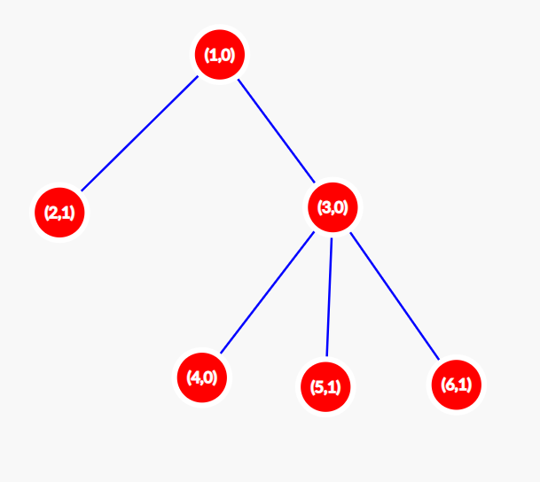
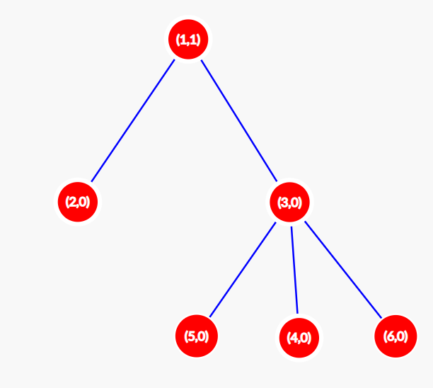
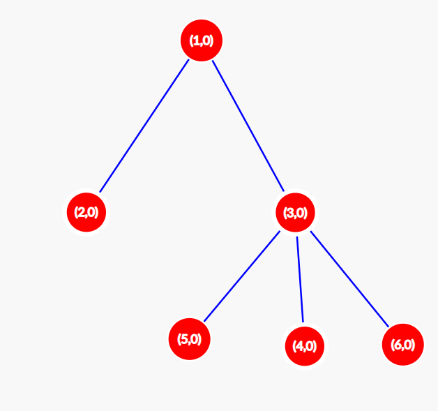

<h1 style='text-align: center;'> D. Score of a Tree</h1>

<h5 style='text-align: center;'>time limit per test: 2 seconds</h5>
<h5 style='text-align: center;'>memory limit per test: 512 megabytes</h5>

You are given a tree of $n$ nodes, rooted at $1$. Every node has a value of either $0$ or $1$ at time $t=0$.

At any integer time $t>0$, the value of a node becomes the [bitwise XOR](https://en.wikipedia.org/wiki/Bitwise_operation#XOR) of the values of its children at time $t - 1$; the values of leaves become $0$ since they don't have any children.

Let $S(t)$ denote the sum of values of all nodes at time $t$. 

Let $F(A)$ denote the sum of $S(t)$ across all values of $t$ such that $0 \le t \le 10^{100}$, where $A$ is the initial assignment of $0$s and $1$s in the tree.

The task is to find the sum of $F(A)$ for all $2^n$ initial configurations of $0$s and $1$s in the tree. Print the sum modulo $10^9+7$.

## Input

Each test contains multiple test cases. The first line contains the number of test cases $t$ ($1 \le t \le 10^5$). The description of the test cases follows.

The first line of each test case contains $n$ ($1 \le n \le 2 \cdot 10^5$) — the number of nodes in the tree.

The next $n-1$ lines of each test case contain two integers each — $u$, $v$ indicating an edge between $u$ and $v$ ($1 \le u, v \le n$).

It is guaranteed that the sum of $n$ over all test cases does not exceed $2 \cdot 10^5$.

## Output

## Output

 the sum modulo $10^9+7$ for each test case.

## Example

## Input


```

161 21 33 43 53 6
```
## Output


```

288

```
## Note

Let us find $F(A)$ for the configuration $A = [0,1,0,0,1,1]$ ($A[i]$ denotes the value of node $i$). Initially (at $t = 0$) our tree is as shown in the picture below. In each node, two values are shown: the number and the value of this node. $S(0)$ for this configuration is $3$. 

  At $t = 1$ the configuration changes to $[1,0,0,0,0,0]$. The tree looks as shown below. $S(1) = 1$. 

  At $t = 2$ the configuration changes to $[0,0,0,0,0,0]$. The tree looks as shown below. $S(2) = 0$. 

  For all $t>2$, the graph remains unchanged, so $S(t)=0$ for all $t > 2$. So, for the initial configuration $A = [0,1,0,0,1,1]$, the value of $F(A) = 3 + 1 = 4$.

Doing this process for all possible $2^{6}$ configurations yields us an answer of $\textbf{288}$. 


#### tags 

#1900 #bitmasks #combinatorics #dfs_and_similar #dp #math #probabilities #trees 