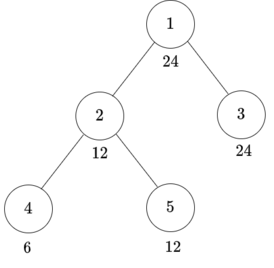
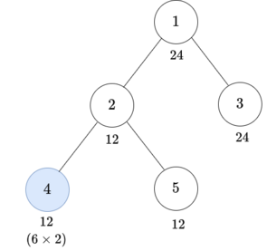
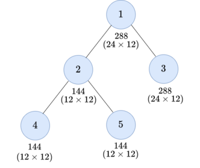
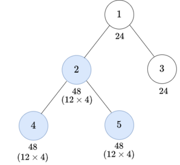
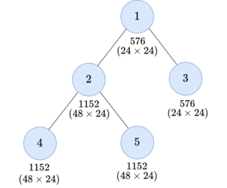

<h1 style='text-align: center;'> F. Maximizing Root</h1>

<h5 style='text-align: center;'>time limit per test: 2 seconds</h5>
<h5 style='text-align: center;'>memory limit per test: 1024 megabytes</h5>

You are given a rooted tree consisting of $n$ vertices numbered from $1$ to $n$. Vertex $1$ is the root of the tree. Each vertex has an integer value. The value of $i$-th vertex is $a_i$. You can do the following operation at most $k$ times.

* Choose a vertex $v$ that has not been chosen before and an integer $x$ such that $x$ is a common divisor of the values of all vertices of the subtree of $v$. Multiply by $x$ the value of each vertex in the subtree of $v$.

What is the maximum possible value of the root node $1$ after at most $k$ operations? Formally, you have to maximize the value of $a_1$.

A tree is a connected undirected graph without cycles. A rooted tree is a tree with a selected vertex, which is called the root. The subtree of a node $u$ is the set of all nodes $y$ such that the simple path from $y$ to the root passes through $u$. ## Note

 that $u$ is in the subtree of $u$.

## Input

The first line contains an integer $t$ ($1 \leq t \leq 50\,000$) — the number of test cases. The description of the test cases follows.

The first line of each test case contains two integers $n$ and $k$ ($2 \leq n \leq 10^5$, $0 \leq k \leq n$) — the number of vertices in the tree and the number of operations.

The second line contains $n$ integers $a_1, a_2, \ldots, a_n$ ($1 \leq a_i \leq 1000$), where $a_i$ denotes the value of vertex $i$.

Each of the next $n - 1$ lines contains two integers $u_i$ and $v_i$ ($1 \leq u_i, v_i \leq n$, $u_i \neq v_i$), denoting the edge of the tree between vertices $u_i$ and $v_i$. It is guaranteed that the given edges form a tree.

It is guaranteed that the sum of $n$ over all test cases does not exceed $2 \cdot 10^5$.

## Output

For each test case, output the maximum value of the root after performing at most $k$ operations.

## Example

## Input


```

25 224 12 24 6 121 21 32 42 55 324 12 24 6 121 21 32 42 5
```
## Output


```

288
576

```
## Note

Both examples have the same tree:

  For the first test case, you can do two operations as follows: 

* Choose the subtree of vertex $4$ and $x = 2$.    After this operation, the node values become $\{24, 12, 24, 12, 12\}.$
* Choose the subtree of vertex $1$ and $x = 12$.    After this operation, the node values become $\{288, 144, 288, 144, 144\}.$

 The value of the root is $288$ and it is the maximum.For the second test case, you can do three operations as follows: 

* Choose the subtree of vertex $4$ and $x = 2$.    After this operation, the node values become $\{24, 12, 24, 12, 12\}.$
* Choose the subtree of vertex $2$ and $x = 4$.    After this operation, the node values become $\{24, 48, 24, 48, 48\}.$
* Choose the subtree of vertex $1$ and $x = 24$.    After this operation, the node values become $\{576, 1152, 576, 1152, 1152\}.$

 The value of the root is $576$ and it is the maximum.

#### tags 

#2600 #dfs_and_similar #dp #graphs #math #number_theory #trees 