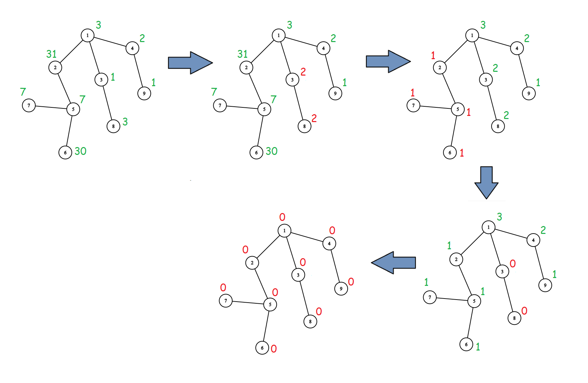

<h1 style='text-align: center;'> F. Xorcerer's Stones</h1>

<h5 style='text-align: center;'>time limit per test: 4 seconds</h5>
<h5 style='text-align: center;'>memory limit per test: 512 megabytes</h5>

Misha had been banned from playing chess for good since he was accused of cheating with an engine. Therefore, he retired and decided to become a xorcerer.

One day, while taking a walk in a park, Misha came across a rooted tree with nodes numbered from $1$ to $n$. The root of the tree is node $1$. 

For each $1\le i\le n$, node $i$ contains $a_i$ stones in it. Misha has recently learned a new spell in his xorcery class and wants to test it out. A spell consists of:

* Choose some node $i$ ($1 \leq i \leq n$).
* Calculate the [bitwise XOR](https://en.wikipedia.org/wiki/Bitwise_operation#XOR) $x$ of all $a_j$ such that node $j$ is in the subtree of $i$ ($i$ belongs to its own subtree).
* Set $a_j$ equal to $x$ for all nodes $j$ in the subtree of $i$.

Misha can perform at most $2n$ spells and he wants to remove all stones from the tree. More formally, he wants $a_i=0$ to hold for each $1\leq i \leq n$. Can you help him perform the spells?

A tree with $n$ nodes is a connected acyclic graph which contains $n-1$ edges. The subtree of node $i$ is the set of all nodes $j$ such that $i$ lies on the simple path from $1$ (the root) to $j$. We consider $i$ to be contained in its own subtree.

## Input

The first line contains a single integer $n$ ($2 \leq n \leq 2\cdot 10^5$) — the size of the tree

The second line contains an array of integers $a_1,a_2,\ldots, a_n$ ($0 \leq a_i \leq 31$), describing the number of stones in each node initially.

The third line contains an array of integers $p_2,p_3,\ldots, p_n$ ($1 \leq p_i \leq i-1$), where $p_i$ means that there is an edge connecting $p_i$ and $i$.

## Output

If there is not a valid sequence of spells, output $-1$.

Otherwise, output a single integer $q$ ($0 \leq q \leq 2n$) in the first line — the number of performed spells.

In the second line output a sequence of integers $v_1,v_2,\ldots,v_q$ ($1 \leq v_i \leq n$) — the $i$-th spell will be performed on the subtree of node $v_i$. Please note that order matters.

If multiple solutions exist, output any. You don't have to minimize the number of operations.

## Examples

## Input


```

2
13 13
1

```
## Output


```

1
1

```
## Input


```

7
5 2 8 3 4 1 31
1 1 2 2 3 3

```
## Output


```

-1

```
## Input


```

9
3 31 1 2 7 30 7 3 1
1 1 1 2 5 5 3 4

```
## Output


```

6
3 2 3 1 2 2
```
## Note

Please refer to the following pictures for an explanation of the third test. Only the first $4$ spells are shown since the last $2$ do nothing. The first picture represents the tree initially with the number of stones for each node written above it in green. Changes applied by the current spell are highlighted in red.

  

#### tags 

#2500 #bitmasks #constructive_algorithms #dp #trees 