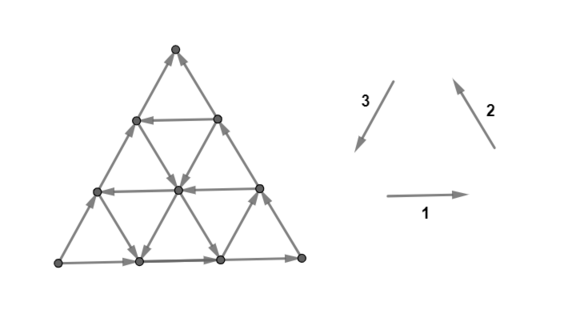
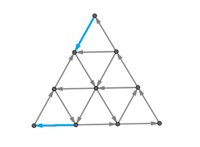

<h1 style='text-align: center;'> G. The Game of the Century</h1>

<h5 style='text-align: center;'>time limit per test: 2 seconds</h5>
<h5 style='text-align: center;'>memory limit per test: 256 megabytes</h5>

The time has finally come, MKnez and Baltic are to host The Game of the Century. For that purpose, they built a village to lodge its participants.

The village has the shape of an equilateral triangle delimited by three roads of length $n$. It is cut into $n^2$ smaller equilateral triangles, of side length $1$, by $3n-3$ additional roads which run parallel to the sides. See the figure for $n=3$. Each of the $3n$ roads is made of multiple (possibly $1$) road segments of length $1$ which connect adjacent intersections.

  The direction has already been chosen for each of the $3n$ roads (so, for each road, the same direction is assigned to all its road segments). Traffic can only go in the specified directions (i. e. the roads are monodirectional).

You are tasked with making adjustments to the traffic plan so that from each intersection it is possible to reach every other intersection. Specifically, you can invert the traffic direction of any number of road segments of length $1$. What is the minimal number of road segments for which you need to invert the traffic direction?

## Input

Each test contains multiple test cases. The first line contains the number of test cases $t$ ($1 \leq t \leq 10\,000$). The description of the test cases follows.

The first line of each test case contains a positive integer $n$ ($1\leq n\leq 10^5$)  — the size of the triangular village's sides.

Three lines follow, each containing a binary string of length $n$ which describes the traffic directions of the roads. 

The $i$-th of the following three lines contains a binary string $s_i$ of length $n$ representing the direction of each road parallel to the road segment denoted by $i$ in the picture above. In particular, the $j$-th character of $s_i$ is "1" if the $j$-th shortest road (parallel to the road segment denoted by $i$ in the picture) has the same direction of the road segment denoted by $i$ in the picture, while it is "0" if it has the opposite direction. So the first character of $s_i$ describes the direction of the road containing only $1$ road segment, while the last character describes the direction of the road containing $n$ road segments.

It is guaranteed that the sum of $n$ over all test cases does not exceed $10^5$.

## Output

For each test case, print the minimum number of road segments for which you need to invert the traffic direction.

## Example

## Input


```

3300100101010003111011100
```
## Output


```

2
0
3

```
## Note

The first example corresponds to the picture in the statement. There exist multiple solutions that invert the traffic direction of exactly $2$ road segments, but inverting only $1$ road segment never makes it possible to reach every intersection from any other. One of the possible solutions is shown in the picture below in which the inverted road segments are highlighted in blue.

  In the second example, the answer is $0$ since it is already possible to reach every intersection from any other.


#### tags 

#3000 #constructive_algorithms #graphs #shortest_paths 