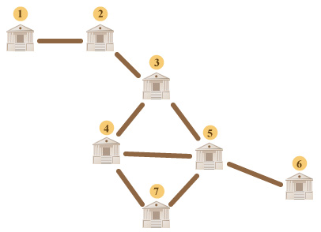

<h1 style='text-align: center;'> B3. Greedy Merchants</h1>

<h5 style='text-align: center;'>time limit per test: 2 seconds</h5>
<h5 style='text-align: center;'>memory limit per test: 256 megabytes</h5>

In ABBYY a wonderful Smart Beaver lives. This time, he began to study history. When he read about the Roman Empire, he became interested in the life of merchants.

The Roman Empire consisted of *n* cities numbered from 1 to *n*. It also had *m* bidirectional roads numbered from 1 to *m*. Each road connected two different cities. Any two cities were connected by no more than one road.

We say that there is a path between cities *c*1 and *c*2 if there exists a finite sequence of cities *t*1, *t*2, ..., *t**p* (*p* ≥ 1) such that:

* *t*1 = *c*1
* *t**p* = *c*2
* for any *i* (1 ≤ *i* < *p*), cities *t**i* and *t**i* + 1 are connected by a road

We know that there existed a path between any two cities in the Roman Empire.

In the Empire *k* merchants lived numbered from 1 to *k*. For each merchant we know a pair of numbers *s**i* and *l**i*, where *s**i* is the number of the city where this merchant's warehouse is, and *l**i* is the number of the city where his shop is. The shop and the warehouse could be located in different cities, so the merchants had to deliver goods from the warehouse to the shop.

Let's call a road important for the merchant if its destruction threatens to ruin the merchant, that is, without this road there is no path from the merchant's warehouse to his shop. Merchants in the Roman Empire are very greedy, so each merchant pays a tax (1 dinar) only for those roads which are important for him. In other words, each merchant pays *d**i* dinars of tax, where *d**i* (*d**i* ≥ 0) is the number of roads important for the *i*-th merchant.

The tax collection day came in the Empire. The Smart Beaver from ABBYY is very curious by nature, so he decided to count how many dinars each merchant had paid that day. And now he needs your help.

## Input

The first input line contains two integers *n* and *m*, separated by a space, *n* is the number of cities, and *m* is the number of roads in the empire.

The following *m* lines contain pairs of integers *a**i*, *b**i* (1 ≤ *a**i*, *b**i* ≤ *n*, *a**i* ≠ *b**i*), separated by a space — the numbers of cities connected by the *i*-th road. It is guaranteed that any two cities are connected by no more than one road and that there exists a path between any two cities in the Roman Empire.

The next line contains a single integer *k* — the number of merchants in the empire.

The following *k* lines contain pairs of integers *s**i*, *l**i* (1 ≤ *s**i*, *l**i* ≤ *n*), separated by a space, — *s**i* is the number of the city in which the warehouse of the *i*-th merchant is located, and *l**i* is the number of the city in which the shop of the *i*-th merchant is located.

The input limitations for getting 20 points are: 

* 1 ≤ *n* ≤ 200
* 1 ≤ *m* ≤ 200
* 1 ≤ *k* ≤ 200

The input limitations for getting 50 points are: 

* 1 ≤ *n* ≤ 2000
* 1 ≤ *m* ≤ 2000
* 1 ≤ *k* ≤ 2000

The input limitations for getting 100 points are: 

* 1 ≤ *n* ≤ 105
* 1 ≤ *m* ≤ 105
* 1 ≤ *k* ≤ 105
## Output

Print exactly *k* lines, the *i*-th line should contain a single integer *d**i* — the number of dinars that the *i*-th merchant paid.

## Examples

## Input


```
7 8  
1 2  
2 3  
3 4  
4 5  
5 6  
5 7  
3 5  
4 7  
4  
1 5  
2 4  
2 6  
4 7  

```
## Output


```
2  
1  
2  
0  

```
## Note

The given sample is illustrated in the figure below. 

  Let's describe the result for the first merchant. The merchant's warehouse is located in city 1 and his shop is in city 5. Let us note that if either road, (1, 2) or (2, 3) is destroyed, there won't be any path between cities 1 and 5 anymore. If any other road is destroyed, the path will be preserved. That's why for the given merchant the answer is 2.


#### tags 

#1800 