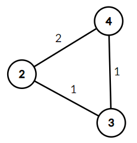

<h1 style='text-align: center;'> E. Josuke and Complete Graph</h1>

<h5 style='text-align: center;'>time limit per test: 2 seconds</h5>
<h5 style='text-align: center;'>memory limit per test: 256 megabytes</h5>

Josuke received a huge undirected weighted complete$^\dagger$ graph $G$ as a gift from his grandfather. The graph contains $10^{18}$ vertices. The peculiarity of the gift is that the weight of the edge between the different vertices $u$ and $v$ is equal to $\gcd(u, v)^\ddagger$. Josuke decided to experiment and make a new graph $G'$. To do this, he chooses two integers $l \le r$ and deletes all vertices except such vertices $v$ that $l \le v \le r$, and also deletes all the edges except between the remaining vertices.

Now Josuke is wondering how many different weights are there in $G'$. Since their count turned out to be huge, he asks for your help.

$^\dagger$ A complete graph is a simple undirected graph in which every pair of distinct vertices is adjacent.

$^\ddagger$ $\gcd(x, y)$ denotes the [greatest common divisor (GCD)](https://en.wikipedia.org/wiki/Greatest_common_divisor) of the numbers $x$ and $y$.

## Input

The first line contains one integer $t$ ($1 \le t \le 100$) — the number of test cases.

The first line of each test case contains two numbers $l$, $r$ ($1 \le l \le r \le 10^{18}$, $l \le 10^9$).

## Output

For each test case print a single number — the number of different weights among the remaining edges.

## Example

## Input


```

72 416 242 61 103 32562 2568125 100090
```
## Output


```

2
6
3
5
0
5
50045

```
## Note

  The graph $G'$ for the first test case. The picture above shows that the graph has $2$ different weights.

In the fifth test case, there is only one vertex from which no edges originate, so the answer is $0$.


#### tags 

#2400 #binary_search #brute_force #data_structures #math #number_theory 