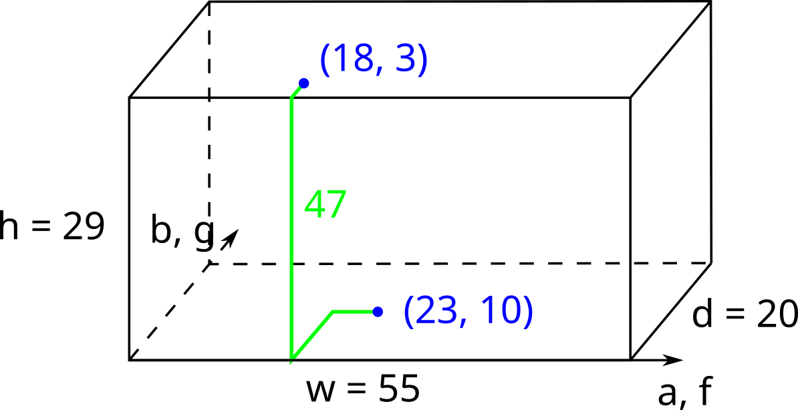

<h1 style='text-align: center;'> A. Parallel Projection</h1>

<h5 style='text-align: center;'>time limit per test: 1 second</h5>
<h5 style='text-align: center;'>memory limit per test: 512 megabytes</h5>

Vika's house has a room in a shape of a rectangular parallelepiped (also known as a rectangular cuboid). Its floor is a rectangle of size $w \times d$, and the ceiling is right above at the constant height of $h$. Let's introduce a coordinate system on the floor so that its corners are at points $(0, 0)$, $(w, 0)$, $(w, d)$, and $(0, d)$.

A laptop is standing on the floor at point $(a, b)$. A projector is hanging on the ceiling right above point $(f, g)$. Vika wants to connect the laptop and the projector with a cable in such a way that the cable always goes along the walls, ceiling, or floor (i. e. does not go inside the cuboid). Additionally, the cable should always run parallel to one of the cuboid's edges (i. e. it can not go diagonally).

What is the minimum length of a cable that can connect the laptop to the projector?

  Illustration for the first test case. One of the optimal ways to put the cable is shown in green. ## Input

Each test contains multiple test cases. The first line contains the number of test cases $t$ ($1 \le t \le 10^4$). The description of the test cases follows.

The first line of each test case contains three integers $w$, $d$, and $h$ ($2 \le w, d, h \le 1000$) — the size of the room.

The second line contains four integers $a$, $b$, $f$, $g$ ($0 < a, f < w$; $0 < b, g < d$): the laptop is located on the floor at point $(a, b)$, while the projector is hanging on the ceiling right above point $(f, g)$.

## Output

For each test case, print a single integer — the minimum length of the cable connecting the laptop and the projector that runs only along the walls, floor, and ceiling parallel to cuboid's edges.

## Example

## Input


```

555 20 2923 10 18 320 10 51 5 2 515 15 47 13 10 102 1000 21 1 1 99910 4 107 1 2 1
```
## Output


```

47
8
14
1002
17

```
## Note

The picture in the statement illustrates the first test case.


#### tags 

#800 #geometry #math 