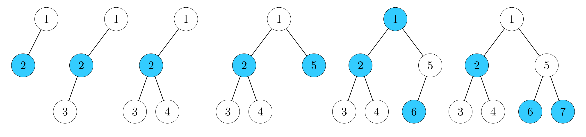

<h1 style='text-align: center;'> G. Diverse Coloring</h1>

<h5 style='text-align: center;'>time limit per test: 4 seconds</h5>
<h5 style='text-align: center;'>memory limit per test: 512 megabytes</h5>

In this problem, we will be working with rooted binary trees. A tree is called a rooted binary tree if it has a fixed root and every vertex has at most two children.

Let's assign a color — white or blue — to each vertex of the tree, and call this assignment a coloring of the tree. Let's call a coloring diverse if every vertex has a neighbor (a parent or a child) colored into an opposite color compared to this vertex. It can be shown that any tree with at least two vertices allows a diverse coloring.

Let's define the disbalance of a coloring as the absolute value of the difference between the number of white vertices and the number of blue vertices.

Now to the problem. Initially, the tree consists of a single vertex with the number $1$ which is its root. Then, for each $i$ from $2$ to $n$, a new vertex $i$ appears in the tree, and it becomes a child of vertex $p_i$. It is guaranteed that after each step the tree will keep being a binary tree rooted at vertex $1$, that is, each vertex will have at most two children.

After every new vertex is added, print the smallest value of disbalance over all possible diverse colorings of the current tree. Moreover, after adding the last vertex with the number $n$, also print a diverse coloring with the smallest possible disbalance as well.

## Input

Each test contains multiple test cases. The first line contains the number of test cases $t$ ($1 \le t \le 10^4$). The description of the test cases follows.

The first line of each test case contains a single integer $n$ ($2 \le n \le 2 \cdot 10^5$) — the number of vertices in the final tree.

The second line contains $n-1$ integers $p_2, p_3, \ldots, p_n$ ($1 \le p_i \le i - 1$) — the numbers of parents of vertices $2, 3, \ldots, n$. No integer appears more than twice among $p_2, p_3, \ldots, p_n$.

It is guaranteed that the sum of $n$ over all test cases does not exceed $2 \cdot 10^5$.

## Output

For each test case, print $n-1$ integers — the smallest value of disbalance over all possible diverse colorings of the tree after adding vertices $2, 3, \ldots, n$.

Then print a string of $n$ characters 'w' and 'b', describing a diverse coloring with the smallest possible disbalance for the whole tree after adding vertex $n$: the $i$-th character must be equal to 'w' if vertex $i$ is colored white, and 'b' if it's colored blue. The absolute value of the difference between the numbers of 'w' and 'b' characters must be equal to the last printed integer. Each vertex must have a parent or a child colored into the color opposite to the vertex's color.

## Example

## Input


```

271 2 2 1 5 581 2 3 4 5 6 7
```
## Output


```

0
1
2
1
0
1
wbwwwbb
0
1
0
1
0
1
0
wbwbwbwb

```
## Note

In the first test case, examples of diverse colorings with the smallest possible disbalances for all intermediate trees are illustrated below:

  

#### tags 

#3200 #constructive_algorithms #trees 