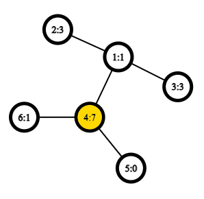
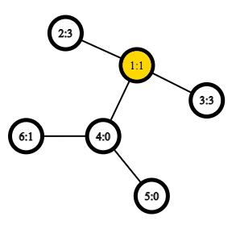
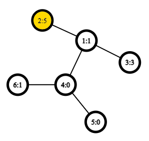

<h1 style='text-align: center;'> G. Weighed Tree Radius</h1>

<h5 style='text-align: center;'>time limit per test: 6 seconds</h5>
<h5 style='text-align: center;'>memory limit per test: 512 megabytes</h5>

You are given a tree of $n$ vertices and $n - 1$ edges. The $i$-th vertex has an initial weight $a_i$.

Let the distance $d_v(u)$ from vertex $v$ to vertex $u$ be the number of edges on the path from $v$ to $u$. ## Note

 that $d_v(u) = d_u(v)$ and $d_v(v) = 0$.

Let the weighted distance $w_v(u)$ from $v$ to $u$ be $w_v(u) = d_v(u) + a_u$. ## Note

 that $w_v(v) = a_v$ and $w_v(u) \neq w_u(v)$ if $a_u \neq a_v$.

Analogically to usual distance, let's define the eccentricity $e(v)$ of vertex $v$ as the greatest weighted distance from $v$ to any other vertex (including $v$ itself), or $e(v) = \max\limits_{1 \le u \le n}{w_v(u)}$.

Finally, let's define the radius $r$ of the tree as the minimum eccentricity of any vertex, or $r = \min\limits_{1 \le v \le n}{e(v)}$.

You need to perform $m$ queries of the following form: 

* $v_j$ $x_j$ — assign $a_{v_j} = x_j$.

After performing each query, print the radius $r$ of the current tree.

## Input

The first line contains the single integer $n$ ($2 \le n \le 2 \cdot 10^5$) — the number of vertices in the tree.

The second line contains $n$ integers $a_1, \dots, a_n$ ($0 \le a_i \le 10^6$) — the initial weights of vertices.

Next $n - 1$ lines contain edges of tree. The $i$-th line contains two integers $u_i$ and $v_i$ ($1 \le u_i, v_i \le n$; $u_i \neq v_i$) — the corresponding edge. The given edges form a tree.

The next line contains the single integer $m$ ($1 \le m \le 10^5$) — the number of queries.

Next $m$ lines contain queries — one query per line. The $j$-th query contains two integers $v_j$ and $x_j$ ($1 \le v_j \le n$; $0 \le x_j \le 10^6$) — a vertex and it's new weight.

## Output

Print $m$ integers — the radius $r$ of the tree after performing each query.

## Example

## Input


```

6
1 3 3 7 0 1
2 1
1 3
1 4
5 4
4 6
5
4 7
4 0
2 5
5 10
5 5

```
## Output


```

7
4
5
10
7

```
## Note

After the first query, you have the following tree: 

   The marked vertex in the picture is the vertex with minimum $e(v)$, or $r = e(4) = 7$. The eccentricities of the other vertices are the following: $e(1) = 8$, $e(2) = 9$, $e(3) = 9$, $e(5) = 8$, $e(6) = 8$.The tree after the second query: 

   The radius $r = e(1) = 4$.After the third query, the radius $r = e(2) = 5$: 

  

#### tags 

#2800 #data_structures #divide_and_conquer #implementation #trees 